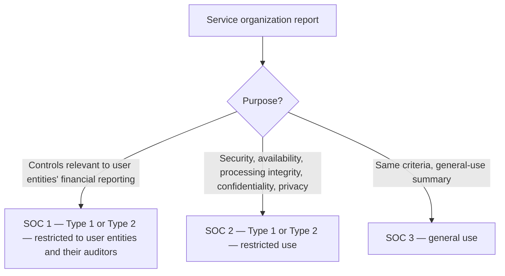

## Three levels of service

| | Examination | Review | Agreed-upon procedures |
|---|---|---|---|
| Assurance | Reasonable | Limited | None |
| Procedures | Like an audit — risk assessment, tests | Mainly inquiry and analytics | Specific procedures agreed with the engaging party |
| Report | Opinion | Conclusion (negative assurance) | Procedures and findings |
| Written assertion | Requested | Requested | Not required |

```check
aud-at-chk1
```

## Preconditions

1. The practitioner is independent (for examinations, reviews, and AUPs).
2. A responsible party exists and takes responsibility for the subject matter.
3. The subject matter is appropriate (identifiable and measurable against criteria).
4. The criteria are **suitable** (relevant, objective, measurable, complete) and **available** to users.
5. The practitioner expects to obtain the evidence needed.

## SOC reports



## Prospective financial information

```worked
title: Forecast or projection?
scenario: |
  Two clients request help with prospective statements.
steps:
  - label: Management's best estimate of next year's results for a bank loan application
    work: Expected conditions
    result: Financial forecast — can be examined, compiled, or subjected to AUP; general use allowed
  - label: '"What if we open two new stores?" statements for a potential investor'
    work: Hypothetical assumptions
    result: Financial projection — restricted use (to parties negotiating directly with the entity)
  - label: The client asks for a review of the forecast
    work: AT-C 305
    result: Not permitted — reviews of prospective information aren't allowed
insight: Examinations of PFI express an opinion on whether the statements follow the presentation guidelines and whether the assumptions provide a reasonable basis.
```

```check
aud-at-chk2
```
