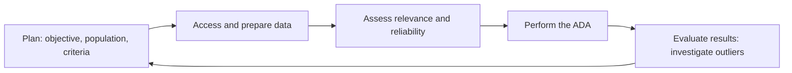

## The ADA cycle



## Where analytics fit

| Stage | Example ADA |
|---|---|
| Risk assessment | Visualize monthly revenue by product and region to spot unusual spikes |
| Tests of controls | Test every purchase order over $10,000 for the required approval field |
| Substantive procedures | Three-way match of all invoices to POs and receiving reports; recompute every aged receivable |
| Fraud procedures | Journal entries posted on weekends, by unusual users, or with round amounts; vendor–employee address matches |
| Overall review | Compare final statements with expectations and the auditor's understanding |

```check
aud-da-chk1
```

## Is the data good enough?

Information produced by the entity (IPE) must be evaluated for **completeness and accuracy** before it's used as evidence.

```worked
title: Validating a sales data extract
scenario: |
  The client provides a 180,000-line sales extract for an ADA that recomputes each invoice's revenue.
steps:
  - label: Completeness
    work: Reconcile the extract's total to general ledger revenue (and record counts to system reports)
    result: The extract totals $48.2 million; the GL shows $48.2 million — agrees
  - label: Accuracy
    work: Agree a few lines to source invoices; test the ITGCs over the report that created the extract
    result: No exceptions
  - label: Perform and evaluate
    work: The recomputation flags 27 invoices whose prices differ from the price master
    result: Investigate each — pricing errors, approved discounts, or potential fraud
insight: An ADA on unreconciled data can give false comfort. Reconcile first, analyze second.
```

## Final analytical procedures

Near the end of the audit, the auditor performs analytics to check that the statements make sense as a whole. Unexpected relationships not already explained may point to risks that were missed — requiring the auditor to revise the risk assessment and perform more procedures.

```check
aud-da-chk2
```

## Acting on analytics output

An exception report is a starting point, not a conclusion. For each flag, decide which of three responses fits:

| Situation | Response |
|---|---|
| Flags point to a fraud or override risk (post-close manual entries, unauthorized users, unusual revenue spikes) | Investigate **every** flagged item: inspect support, and inquire of someone other than the preparer |
| The test was poorly designed (it flags system batch jobs or other expected activity) | Refine the parameters and rerun |
| The flags are explained by activity already corroborated (tested recurring schedules) | Document the explanation; no further investigation |

## Evaluating differences in analytical procedures

1. Compare the recorded amount with the **expectation** and the **threshold** set in advance.
2. If the difference exceeds the threshold, investigate the **whole** difference, not just the excess.
3. Accept only the explanations you **corroborate** with other evidence; inquiry alone is not enough (AU-C 520).
4. If the difference left after corroborated explanations is below the threshold, the procedure supports the balance. If it is above, perform other substantive procedures or consider a misstatement.

**Final analytical procedures** near the end of the audit may reveal a previously unrecognized risk (for example, receivables growing much faster than revenue). The auditor then revises the risk assessment and performs more procedures.
