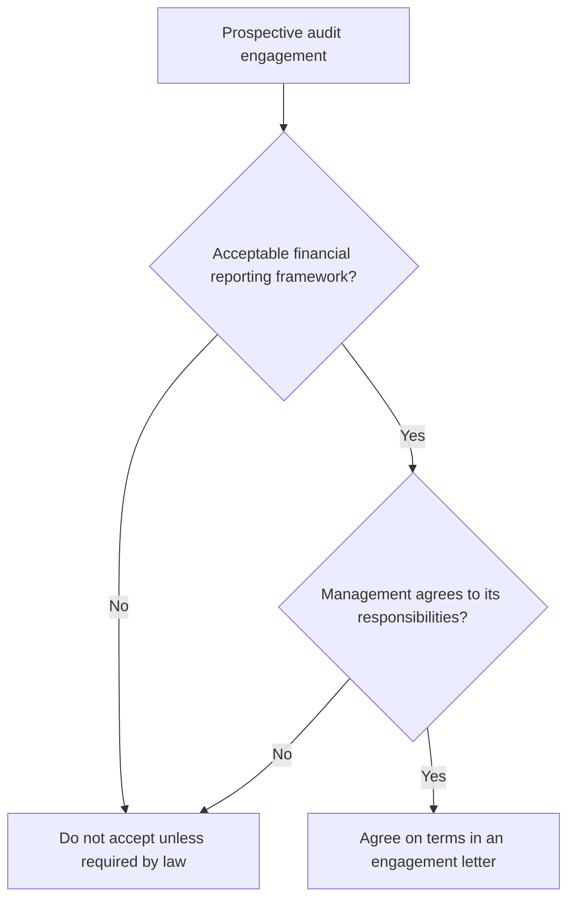

## Preconditions for an audit



Management must acknowledge responsibility for: **(1)** preparing and fairly presenting the statements;
**(2)** designing, implementing, and maintaining internal control; and **(3)** providing access to information,
additional information, and people.

If management imposes a **scope limitation** that would cause the auditor to disclaim an opinion, the auditor should not accept the engagement (unless required by law).

```check
aud-ea-chk1
```

## The engagement letter

| Required | Common additions |
|---|---|
| Objective and scope of the audit | Fees and billing |
| Responsibilities of the auditor | Arrangements for involving specialists or internal auditors |
| Responsibilities of management | Expectation of written representations |
| Inherent limitations of an audit and of internal control | Arrangements with a predecessor auditor |
| The applicable financial reporting framework | Any restriction on the auditor's liability (where permitted) |
| Expected form and content of the report (and that it may differ) | |

The letter is signed by the auditor and by management (or those charged with governance, where appropriate).

## Communicating with the predecessor

```timeline
title: Successor auditor's steps
events:
  - when: Before acceptance
    label: Ask management's permission to contact the predecessor
    detail: If management refuses, consider the reason and the effect on acceptance
  - when: Before acceptance
    label: Inquire of the predecessor
    detail: Management integrity, disagreements, fraud and noncompliance communications, internal control communications, reason for the change
  - when: After acceptance
    label: Request access to the predecessor's working papers
    detail: Helps plan the audit and gather evidence on opening balances
  - when: During the audit
    label: If the prior statements appear misstated
    detail: Ask management to inform the predecessor and arrange a meeting of the three parties
```

The predecessor should respond promptly and fully — unless there are unusual circumstances such as litigation, in which case it should state that its response is limited.

```worked
title: Evaluating a request to change the engagement
scenario: |
  Midway through an audit, Harper Co.'s owner asks to change to a review. Three possible reasons are given.
steps:
  - label: The bank dropped its audit requirement when the loan was repaid
    work: Change in the client's need for the service
    result: Reasonable — the auditor may issue a review report with no reference to the audit
  - label: The owner refuses to let the auditor confirm receivables with the largest customer
    work: Requested to avoid a scope limitation
    result: Not reasonable — do not change; consider the effect on the audit opinion
  - label: The auditor has found a likely material misstatement the owner doesn't want to correct
    work: Requested to avoid unfavorable findings
    result: Not reasonable
insight: If the change is reasonable, the new report should not mention the original engagement, any procedures performed, or any scope limitation.
```

```check
aud-ea-chk2
```
