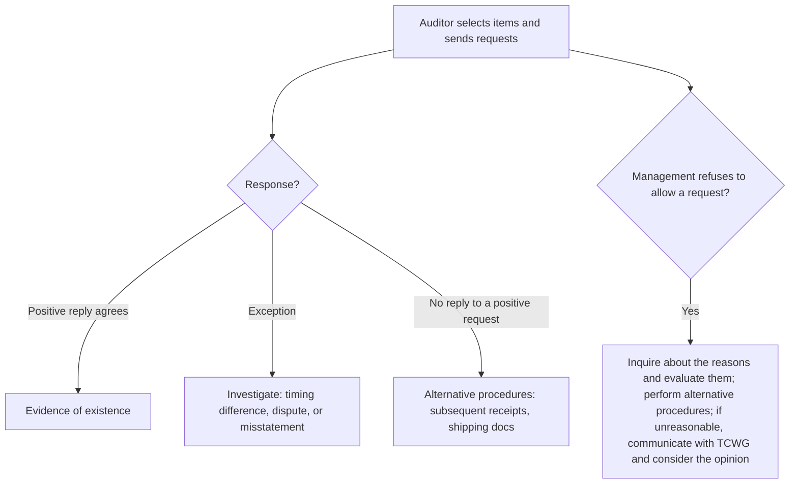

## Assertions

| Transactions (income statement) | Account balances (balance sheet) |
|---|---|
| **Occurrence** — recorded transactions happened | **Existence** — assets and liabilities exist |
| **Completeness** — all transactions are recorded | **Rights and obligations** — the entity owns the assets and owes the liabilities |
| **Accuracy** — amounts are recorded correctly | **Completeness** — all balances are recorded |
| **Cut-off** — recorded in the right period | **Accuracy, valuation and allocation** — at appropriate amounts |
| **Classification** — in the proper accounts | **Classification** — in the proper accounts |
| **Presentation** — appropriately aggregated and described, with disclosures | **Presentation** — appropriately aggregated and described, with disclosures |

```check
aud-ev-chk1
```

## External confirmations (AU-C 505)



```worked
title: Following up confirmation results
scenario: |
  Of 50 positive receivable confirmations, 42 agreed, 3 reported exceptions, and 5 did not reply.
steps:
  - label: Exception — customer says a $6,000 payment was mailed December 30
    work: Trace the payment to the January cash receipts
    result: Timing difference — no misstatement
  - label: Exception — customer disputes a $4,200 invoice for goods never received
    work: Examine shipping documents for the invoice
    result: No shipping document → likely misstatement to project
  - label: Five nonresponses
    work: Examine cash received after year-end that applies to the year-end invoices; if none, examine shipping documents and orders
    result: Alternative procedures substitute for the missing confirmations
insight: A confirmation proves existence. Collectibility (valuation) is tested separately, often with the same subsequent-receipts evidence.
```

## Audit documentation

| | AICPA (nonissuers) | PCAOB (issuers) |
|---|---|---|
| Report date | Date sufficient appropriate evidence obtained | Same |
| Assembly of the final file | Within **60 days** after the report release date | Within **14 days** (AS 1000 amendment; formerly 45) |
| Retention | At least **5 years** from the report release date | **7 years** |

After the documentation completion date, nothing may be deleted. Additions must note who made them, when, and why.

```check
aud-ev-chk2
```

## Concluding on sufficiency and appropriateness

Before concluding on an area, ask two separate questions:

- **Appropriate?** Is the evidence relevant to the assertion and reliable? External evidence the auditor obtains directly beats internal evidence; documents beat inquiry; evidence from a self-interested source (a sales manager vouching for their own inventory) is weak, especially when it contradicts other data.
- **Sufficient?** Is there enough of it, given the assessed risk? A procedure performed on far fewer items than planned is the right kind of evidence, just not enough.

The fix differs: insufficient evidence needs **more of the same**; inappropriate evidence needs **different** evidence. More copies of internally generated invoices will never prove that goods shipped. If the auditor cannot obtain the evidence (for example, management forbids a letter to legal counsel), the result is a scope limitation.
