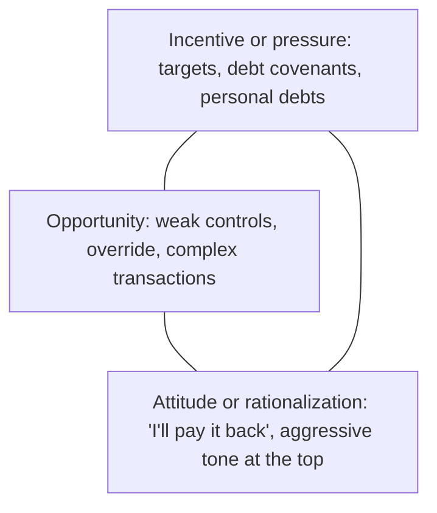

## Two kinds of fraud

| | Fraudulent financial reporting | Misappropriation of assets |
|---|---|---|
| Who | Usually management | Usually employees (often smaller amounts) |
| How | Fictitious revenue, hiding liabilities, biased estimates, improper disclosures | Theft of cash or inventory, fictitious vendors, payroll ghosts |
| Concealment | Top-side journal entries, side agreements | False documents, altered records |

## The fraud triangle



```check
aud-fr-chk1
```

## The two presumed risks

1. **Revenue recognition** — presumed a fraud risk. It can be **rebutted** (e.g., a single revenue stream of simple, fixed rental income), but the auditor must document why.
2. **Management override of controls** — present in every entity and **cannot be rebutted**.

Required procedures for management override — every audit:

| Procedure | Why |
|---|---|
| Test journal entries and other adjustments (especially at period-end, entered by unusual users, to unusual accounts, round amounts, or lacking descriptions) | Top-side entries are the favorite tool of financial reporting fraud |
| Review accounting estimates for bias, including a **retrospective review** of prior-year estimates | Management bias shows up as consistently optimistic estimates |
| Evaluate the business rationale of **significant unusual transactions** | Complex, unusual deals may be designed to disguise results |

```worked
title: Selecting journal entries to test
scenario: |
  Holt Industries posted 48,000 journal entries this year. The auditor designs criteria to select entries for testing.
steps:
  - label: Entries posted in the last 5 days of the year or in the closing process
    work: Period-end timing is higher risk
    result: Select
  - label: Entries posted by the CFO, who doesn't normally post
    work: Unusual users
    result: Select
  - label: Entries crediting revenue with a debit to an unusual account (e.g., a reserve)
    work: Unusual account combinations
    result: Select
  - label: Recurring monthly depreciation entries generated by the system
    work: Routine, automated, low risk
    result: Generally not selected (unless other factors apply)
insight: Use data analytics to filter the whole population with risk-based criteria, then examine support for each selected entry.
```

```check
aud-fr-chk2
```

## When fraud is found or suspected

- Evaluate the implications: fraud involving management is significant even if small, and it affects the reliability of representations.
- Communicate on a timely basis:
  - to **those charged with governance** — fraud involving senior management, or fraud causing a material misstatement;
  - to an **appropriate level of management** (at least one level above those involved) — any fraud or evidence that fraud may exist.
- Disclosure **outside** the entity is generally prohibited by confidentiality, **except**: to comply with legal or regulatory requirements; to a successor auditor responding to inquiries (with client consent); in response to a subpoena; or to a funding agency under government auditing requirements.
- Consider whether to **withdraw** if management doesn't take appropriate action.
