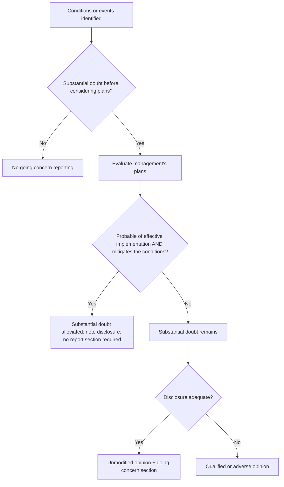

## The evaluation



| Indicator category | Examples |
|---|---|
| Negative trends | Recurring losses, working capital deficiencies, negative operating cash flow |
| Financial difficulty | Loan defaults, arrearages in dividends, denial of trade credit, need to sell substantial assets |
| Internal matters | Work stoppages, dependence on one project, uneconomic long-term commitments |
| External matters | Legal proceedings, loss of a key franchise, license, patent, customer, or supplier; uninsured catastrophe |

```check
aud-gc-chk1
```

## Evaluating management's plans

```worked
title: Are the plans enough?
scenario: |
  Burke Ltd. has a $6 million loan due in five months and cash of $1 million. Management offers three plans.
steps:
  - label: Plan A — refinance with the current lender
    work: The lender has sent a signed commitment letter with no unusual conditions
    result: Probable of implementation — strong evidence
  - label: Plan B — sell a warehouse for $3 million
    work: No buyer identified; the market is weak
    result: Not probable — gives little weight
  - label: Plan C — owner will contribute capital "if needed"
    work: No written commitment; the owner's financial capacity is unknown
    result: Not probable without evidence of ability and intent
insight: Evidence of plans means documents — commitment letters, signed agreements, financial capacity — not intentions.
```

```check
aud-gc-chk2
```

## Reporting

| Situation | Opinion | Report content |
|---|---|---|
| No substantial doubt | Unmodified | Nothing about going concern |
| Substantial doubt alleviated by plans | Unmodified | Nothing required (auditor may add emphasis of matter) |
| Substantial doubt remains; adequate disclosure | Unmodified | Separate "Substantial Doubt About the Entity's Ability to Continue as a Going Concern" section |
| Inadequate disclosure | Qualified or adverse | Basis for the modification |
| Multiple significant uncertainties (rare) | Disclaimer permitted | |
