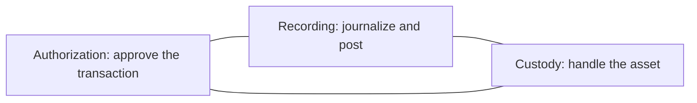
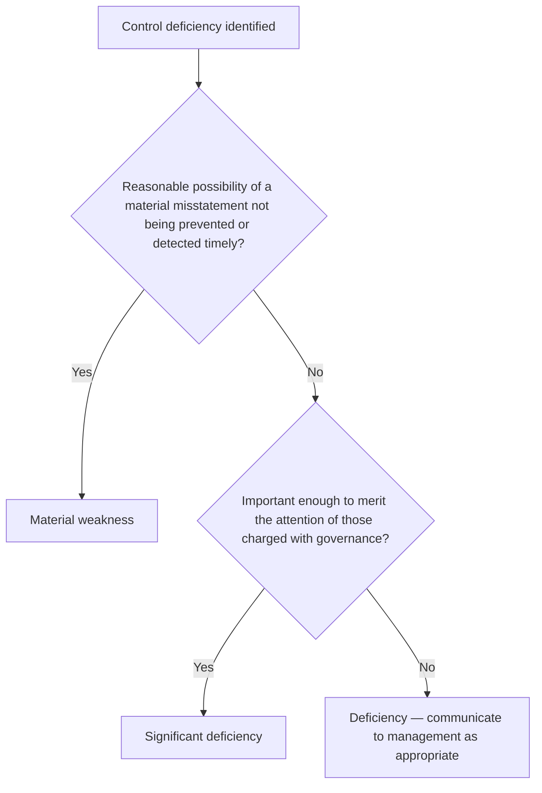

## The five components

| Component | What it is | Example |
|---|---|---|
| **Control environment** | Tone at the top: integrity, ethics, board oversight, competence, accountability | An independent audit committee; a code of conduct enforced consistently |
| **Risk assessment** | How the entity identifies and responds to risks to its objectives, including fraud and change | Evaluating the controls needed for a new product line |
| **Control activities** | Policies and procedures that carry out management's directives | Approvals, reconciliations, physical safeguards |
| **Information and communication** | Systems that capture and report information; communication of responsibilities | The general ledger system; a whistleblower hotline |
| **Monitoring activities** | Ongoing and separate evaluations of whether controls work | Internal audit reviews; management's review of exception reports |

Mnemonic: **CRIME** — Control activities, Risk assessment, Information and communication, Monitoring, (control) Environment.

```check
aud-ic-chk1
```

## Segregation of duties



No single person should control two of the three functions for the same transaction. When staff are too few to segregate, compensating controls include owner review of bank statements, mandatory vacations, and independent reconciliation.

```worked
title: Spotting a deficiency in cash receipts
scenario: |
  At Pell Hardware, the receivables clerk opens the mail, lists the checks, prepares the deposit, posts the
  customer accounts, and approves credit memos. The controller reconciles the bank account monthly.
steps:
  - label: Which functions does the clerk combine?
    work: Custody (checks and deposit), recording (posting), and authorization (credit memos)
    result: All three — a serious segregation failure
  - label: How could fraud occur?
    work: Steal a customer check, then conceal it with an unauthorized credit memo
    result: The bank reconciliation won't catch it — the stolen check was never deposited
  - label: Remedy
    work: A separate person opens the mail and prepares a remittance list; credit memos are approved by the credit manager; the list is compared with the deposit slip and postings
    result: Custody, recording, and authorization separated
insight: A reconciliation catches differences between two records. It cannot catch a transaction that never entered either record — that's why lapping and credit-memo concealment defeat it.
```

## Classifying deficiencies



**Indicators of a material weakness:** fraud by senior management (material or not); a restatement to correct a material misstatement; a material misstatement found by the auditor that the controls would not have detected; ineffective oversight by those charged with governance.

```check
aud-ic-chk2
```

## Communication (AU-C 265)

- Significant deficiencies and material weaknesses: **in writing** to management and those charged with governance.
- Timing: best by the report release date, and no later than **60 days** after it.
- The communication states that the audit was not designed to express an opinion on internal control, and its use is restricted.
- The auditor should **not** issue a written communication stating that no significant deficiencies were identified. (A communication that no *material weaknesses* were identified may be issued, for example for a regulator.)

## From deficiency to audit response

Classify the deficiency, then follow it through to the audit plan:

| Severity | Typical indicators | Effect on the audit |
|---|---|---|
| Control deficiency | Effective compensating control, or low potential misstatement | Usually no change to planned substantive work |
| Significant deficiency | Reasonably possible misstatement, less than material but merits governance attention | Rely less on the control: more extensive substantive procedures, performed nearer to year-end, with more reliable evidence |
| Material weakness | Reasonable possibility of a **material** misstatement not prevented or detected — for example, a material misstatement found by the auditor that controls missed | Integrated audit: adverse opinion on ICFR; expand substantive procedures in the area |

A misstatement found by substantive testing tells you about the controls too. Ask which control should have caught it. A material weakness in ICFR does not by itself change the financial statement opinion if the misstatement is corrected.
