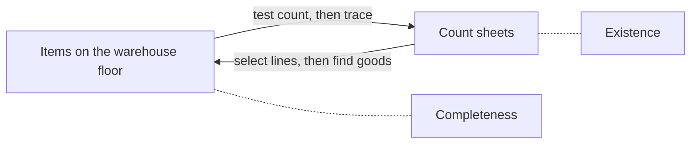

## At the physical count



| During the count, the auditor… | Why |
|---|---|
| Evaluates management's count instructions | Design of the count |
| Observes the counters | Instructions followed |
| Performs test counts (both directions) | Existence and completeness |
| Notes obsolete, damaged, or slow-moving items | Valuation |
| Records the last receiving and shipping document numbers | Cut-off |
| Accounts for all prenumbered count tags | Prevents added or missing tags |

```check
aud-inv-chk1
```

## Ownership and cut-off

| Situation | Include in client's inventory? |
|---|---|
| Goods held on consignment **for** others (consigned-in) | No |
| Client's goods held by consignees (consigned-out) | Yes |
| Goods in transit, purchased FOB shipping point | Yes (control passed at shipment) |
| Goods in transit, sold FOB destination | Yes (still the seller's until delivered) |
| Goods in a public warehouse | Yes — confirm with the warehouse |

## Valuation

- **Cost**: agree unit costs to recent vendor invoices (FIFO) or cost records; test overhead allocations.
- **Lower of cost and NRV**: compare costs with subsequent selling prices less costs to sell.
- **Obsolescence**: inventory turnover by product, items with no recent sales, items noted at the count.

## Property, plant, and equipment

```worked
title: Auditing the PP&E rollforward
scenario: |
  Beginning PP&E $4,000,000 (agreed to prior-year working papers). Additions $900,000; disposals $300,000;
  ending $4,600,000. Repairs and maintenance expense rose from $120,000 to $310,000.
steps:
  - label: Beginning balance
    work: Agree to last year's audited statements
    result: Agreed
  - label: Additions
    work: Vouch large additions to invoices, contracts, and board approvals; inspect some assets
    result: Existence and rights of additions
  - label: Repairs expense up $190,000
    work: Vouch large repair entries — do any extend useful life or add capacity?
    result: A $150,000 roof replacement expensed as a repair → should be capitalized (understated PP&E)
  - label: Disposals
    work: Review insurance and property tax records, scrap sales, and plant tours for retired assets still recorded
    result: Completeness of disposals (existence of the remaining assets)
insight: Expense accounts are where capitalizable items hide; asset accounts are where retired assets hide.
```

```check
aud-inv-chk2
```
