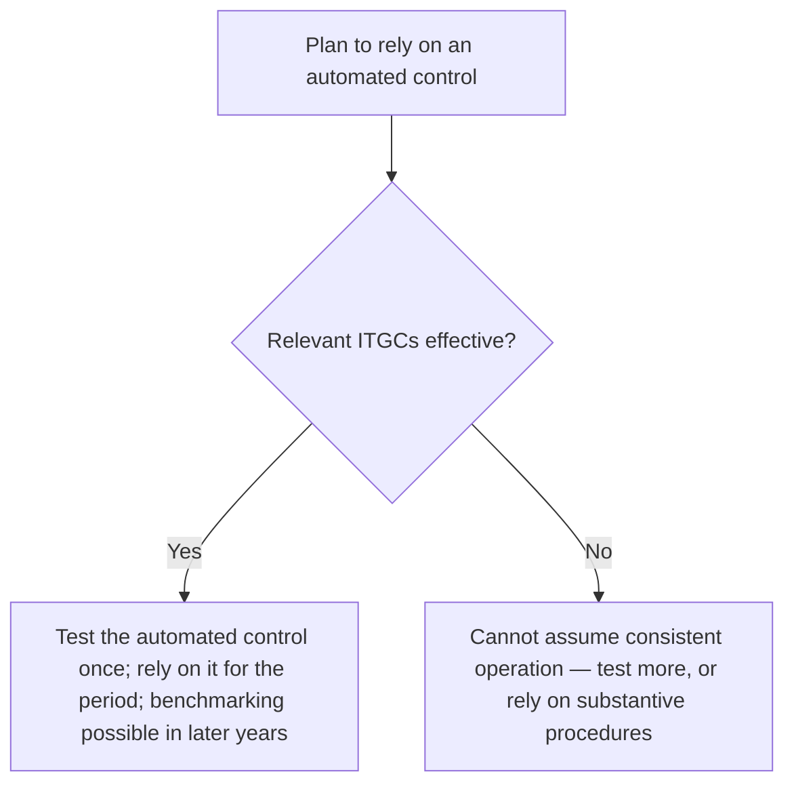

## Two layers

| IT general controls (ITGCs) | Application controls |
|---|---|
| Apply across many applications | Apply to one process or application |
| **Access**: passwords, role-based access, periodic access reviews, prompt removal of terminated users | **Input**: edit and validity checks, limit tests, check digits, required fields |
| **Program changes**: authorization, testing, approval, migration by someone other than the developer | **Processing**: run-to-run totals, sequence checks, matching (three-way match) |
| **Development and acquisition** of new systems | **Output**: reconciliations of output to input, review of exception reports, distribution controls |
| **Operations**: job scheduling, backup and recovery, incident management | |

```check
aud-itc-chk1
```

## Input controls — matching the control to the error

| Error | Control that catches it |
|---|---|
| Customer number keyed as 10236 instead of 10263 | **Check digit** (computed digit that fails when digits are transposed) |
| Hours worked entered as 400 instead of 40 | **Limit or reasonableness test** |
| Vendor ID that doesn't exist | **Validity check** against the master file |
| Missing ship date | **Completeness check** (required field) |
| Letters in an amount field | **Field (format) check** |
| A batch of 50 invoices where one was lost in keying | **Record count** or **financial total** |

```worked
title: Batch totals
scenario: |
  A clerk batches four vendor invoices for entry: vendor numbers 1044, 2051, 3102, 1188; amounts $1,200,
  $450, $3,100, $980.
steps:
  - label: Record count
    work: 4 invoices
    result: 4
  - label: Financial total
    work: 1,200 + 450 + 3,100 + 980
    result: 5,730
  - label: Hash total (vendor numbers)
    work: 1,044 + 2,051 + 3,102 + 1,188
    result: 7,385 — meaningless as a number, but it detects a changed or substituted vendor number
insight: The system recomputes each total after input. A mismatch means an item was lost, duplicated, or changed.
```

```check
aud-itc-chk2
```

## Why ITGCs matter to reliance



- **Access** failures let people change data or bypass controls.
- **Change-management** failures mean a tested program might not be the one that ran all year.
- **Segregation in IT**: developers shouldn't migrate their own changes or access production data.
