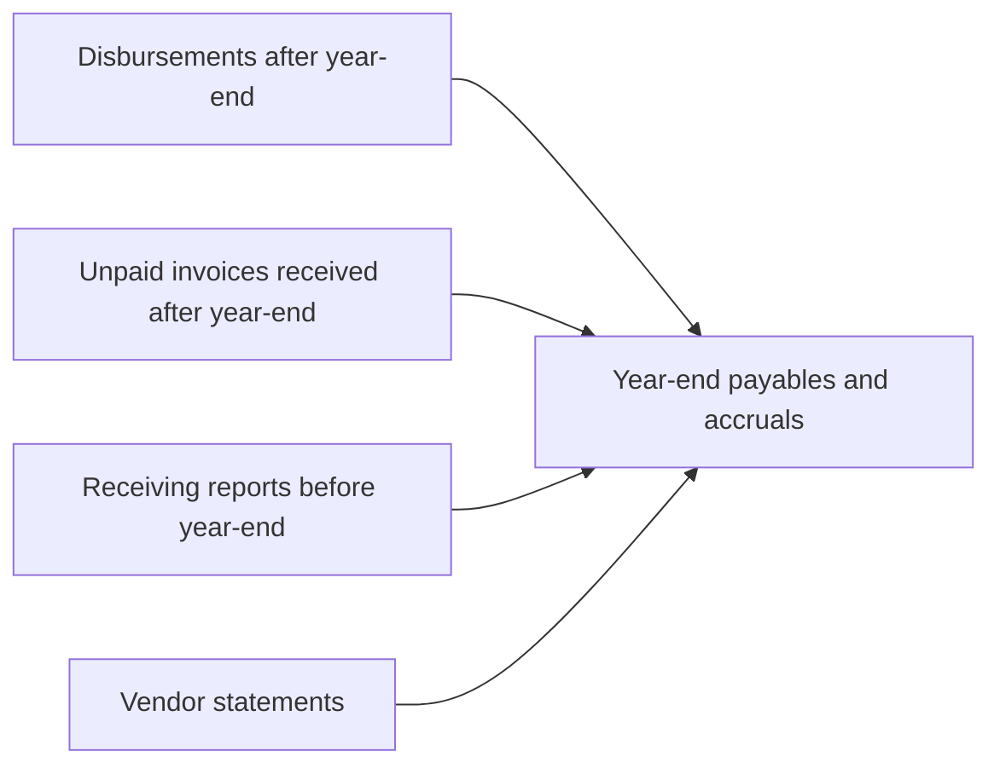

## Search for unrecorded liabilities



Start from outside the recorded population and trace into it. Any obligation that existed at year-end but is missing from payables is an understatement.

```check
aud-le-chk1
```

```worked
title: Evaluating post-year-end disbursements
scenario: |
  Year-end December 31. The auditor examines January disbursements over $10,000.
steps:
  - label: "Jan 8: $42,000 for inventory received December 28"
    work: Liability existed at year-end — is it in payables?
    result: Recorded — no issue
  - label: "Jan 15: $85,000 for plant repairs completed December 20"
    work: Not in payables or accruals
    result: Unrecorded liability — understates expenses and liabilities by $85,000
  - label: "Jan 22: $30,000 for January rent"
    work: Obligation arose in January
    result: Correctly excluded
insight: The key question for each item is "When did the obligation arise?" — not when it was invoiced or paid.
```

## Inquiry of legal counsel

| Step | Detail |
|---|---|
| Management's list | Pending or threatened litigation, and unasserted claims management considers probable of assertion |
| Letter | Sent by management on its letterhead to outside counsel, asking the lawyer to reply directly to the auditor |
| Lawyer's response | Evaluates the likelihood and amount of loss; comments on unasserted claims only if listed; may limit its response to material items |
| Timing | Response dated close to the auditor's report date |
| Refusal | A lawyer's refusal to respond is a **scope limitation** → qualified opinion or disclaimer |

In-house counsel's responses don't substitute for outside counsel on matters that outside counsel handles.

```check
aud-le-chk2
```

## Debt and equity

| Area | Procedures |
|---|---|
| Debt | Confirm balances, rates, and collateral with lenders; read agreements; test covenant compliance; recompute interest and accruals; evaluate current vs. noncurrent classification |
| Equity | Confirm shares with the transfer agent and registrar; read minutes for authorization of issuances, dividends, and repurchases; inspect treasury stock; trace proceeds from issuances to cash receipts |
