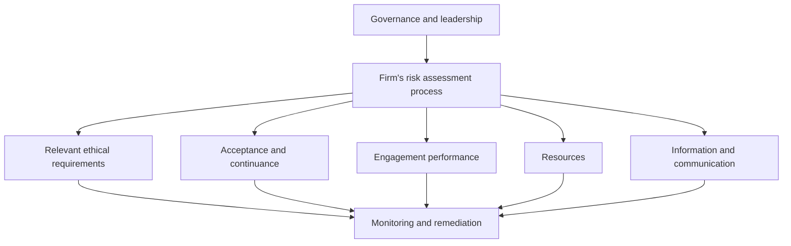

## The eight components (SQMS No. 1)



| Component | What it covers |
|---|---|
| Governance and leadership | Culture, leadership's accountability, and commitment to quality |
| Risk assessment process | Setting quality objectives, identifying quality risks, designing responses |
| Relevant ethical requirements | Independence and the Code |
| Acceptance and continuance | Integrity of the client; firm competence and capacity |
| Engagement performance | Direction, supervision, review, consultation, differences of opinion, EQ reviews |
| Resources | People, technology, intellectual resources, and service providers |
| Information and communication | Getting the right information to the right people |
| Monitoring and remediation | Inspecting engagements, finding deficiencies, root-cause analysis, fixing them |

```check
aud-qm-chk1
```

## Engagement quality reviews (SQMS No. 2)

- **Required** for engagements the firm's policies specify (e.g., based on risk or public interest) and where required by law or regulation. PCAOB rules (AS 1220) require an EQ review for every issuer audit.
- **Timing:** completed before the report is released; the engagement partner may not release the report until the EQ reviewer notifies them the review is complete.
- **Eligibility:** competence, authority, objectivity, and independence. The EQ reviewer cannot be a member of the engagement team. A person who was the engagement partner generally has a **two-year cooling-off** period before becoming the EQ reviewer.
- **Scope:** significant judgments and the conclusions reached — not a re-audit.

```worked
title: Can this person be the EQ reviewer?
scenario: |
  The firm needs an EQ reviewer for the Year 5 audit of Oakridge Health. Three candidates are proposed.
steps:
  - label: Partner Diaz — engagement partner for Years 1–4
    work: Former engagement partner; the cooling-off period has not passed
    result: Not eligible until Year 7 (two-year cooling-off)
  - label: Manager Evans — on the Year 5 engagement team
    work: EQ reviewer cannot be a member of the engagement team
    result: Not eligible
  - label: Partner Fox — health-care specialist, no involvement with Oakridge
    work: Competent, objective, independent
    result: Eligible
insight: Objectivity is the key test. Anyone who helped make the judgments cannot review them.
```

## Engagement partner responsibilities (AU-C 220)

The engagement partner is responsible for managing and achieving quality on the engagement, including:
direction, supervision, and review of the team; making sure the team has sufficient and appropriate resources;
consultation on difficult or contentious matters; and resolving differences of opinion before the report is released.

## External monitoring

| | Peer review (AICPA) | PCAOB inspection |
|---|---|---|
| Who | Firms performing audits and other A&A services for nonissuers | Firms registered with the PCAOB that audit issuers |
| How often | Generally once every 3 years | Annually (>100 issuer audit clients); at least every 3 years otherwise |
| Types | System review (for firms that perform audits); engagement review (other A&A work only) | Inspection of selected engagements and the firm's quality control system |

```check
aud-qm-chk2
```
