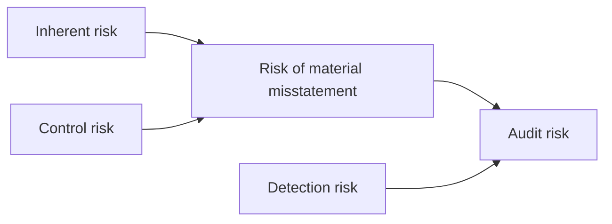

## The audit risk model



| Component | Whose risk? | What the auditor does |
|---|---|---|
| Inherent risk | Entity | Assesses it: complexity, subjectivity, change, uncertainty, susceptibility to bias or fraud |
| Control risk | Entity | Assesses it; testing controls is the only way to assess it below maximum |
| Detection risk | Auditor | **Sets** it by designing substantive procedures |

Audit risk is held constant at a low level, so **detection risk moves inversely with RMM**.

```check
aud-rm-chk1
```

```worked
title: Solving the model for detection risk
scenario: |
  An auditor wants audit risk of 5% for the inventory existence assertion. It assesses inherent risk at
  100% (a large, easily moved inventory) and control risk at 50% (count controls tested and partly effective).
steps:
  - label: Risk of material misstatement
    work: IR × CR = 1.00 × 0.50
    result: 0.50
  - label: Acceptable detection risk
    work: AR ÷ RMM = 0.05 ÷ 0.50
    result: 10%
  - label: What it means
    work: Detection risk of 10% is low
    result: Observe the year-end count, test counts both directions, and use larger samples
insight: The model is a thinking tool — auditors rarely assign numbers. On the exam, "RMM up" always means "detection risk down, more persuasive substantive evidence".
```

```faded
title: Your turn
scenario: |
  For receivables valuation, planned audit risk is 5%, inherent risk is assessed at 80%, and control risk at 25%.
steps:
  - label: Risk of material misstatement (as a decimal)
    answer: 0.2
    tolerance: 0.001
    solution: 0.80 × 0.25 = 0.20
  - label: Acceptable detection risk (as a decimal)
    answer: 0.25
    tolerance: 0.001
    hint: AR ÷ RMM
    solution: 0.05 ÷ 0.20 = 0.25 — relatively high, so less extensive substantive work is acceptable (but never zero).
```

## Responding: nature, timing, extent

When acceptable detection risk is **lower**, change the substantive procedures:

| Lever | More persuasive evidence |
|---|---|
| **Nature** | Tests of details over analytics; external and auditor-generated evidence over internal evidence and inquiry |
| **Timing** | At or near year-end rather than at an interim date |
| **Extent** | Larger samples, lower tolerable misstatement |

For a **significant risk**, the auditor performs substantive procedures specifically responsive to it. If the
response to a significant risk is *only* substantive procedures, they must include **tests of details**.

## Materiality

```worked
title: Setting materiality thresholds
scenario: |
  A stable, profitable manufacturer reports pretax income from continuing operations of $2,000,000. The
  engagement team uses 5% of that benchmark for overall materiality, 75% of overall for performance materiality,
  and 5% of overall as "clearly trivial". (These percentages are common firm practice, not requirements of the standards.)
steps:
  - label: Overall materiality
    work: 2,000,000 × 5%
    result: 100,000
  - label: Performance materiality
    work: 100,000 × 75%
    result: 75,000
  - label: Clearly trivial threshold
    work: 100,000 × 5%
    result: 5,000
insight: Performance materiality is lower than overall materiality so that the total of undetected and uncorrected misstatements is unlikely to exceed overall materiality.
```

```check
aud-rm-chk2
```

**Qualitative factors.** A misstatement smaller than materiality can still be material if, for example, it:
turns a loss into income, masks a change in earnings trend, makes the company meet analysts' expectations or a
debt covenant, affects a segment that is significant to the business, involves fraud or illegal acts, or
increases management's compensation.

**Evaluating misstatements (AU-C 450).** Accumulate all misstatements above clearly trivial; ask management to
correct them; then evaluate the uncorrected total (known plus projected) against materiality, both individually
and in aggregate. When the aggregate *approaches* materiality, the risk that undetected misstatements push it
over is too high — perform more procedures or have management correct more.
