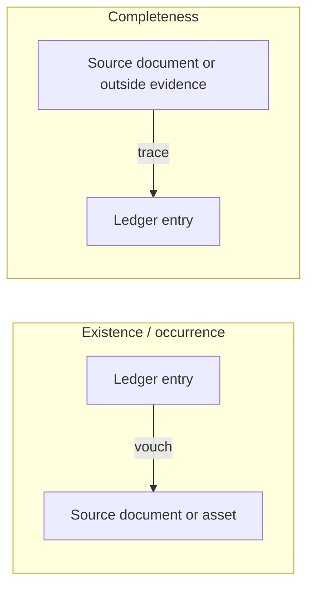

## The toolbox

| Procedure | Example | Typical assertion |
|---|---|---|
| Inspection of records | Vouch sales entries to shipping documents | Occurrence |
| Inspection of assets | Examine equipment additions | Existence |
| Observation | Watch the client's inventory count | Existence |
| Inquiry | Ask about pending litigation | Completeness (never sufficient alone) |
| External confirmation | Confirm receivables with customers | Existence, rights |
| Recalculation | Recompute depreciation | Accuracy, valuation |
| Reperformance | Re-execute an aging to test the control | Control effectiveness |
| Analytical procedures | Expected interest = average debt × rate | Many (depending on precision) |

## Direction of testing



```check
aud-rr-chk1
```

```worked
title: Designing the direction
scenario: |
  The risks for Duncan Supply are (1) fictitious sales and (2) unrecorded purchases at year-end.
steps:
  - label: Fictitious sales (occurrence)
    work: Select sales invoices from the sales journal → vouch to shipping documents and customer orders
    result: Starts from the recorded population, because fictitious items are in the records
  - label: Unrecorded purchases (completeness)
    work: Select receiving reports and cash disbursements after year-end → trace to the purchases journal and accounts payable
    result: Starts outside the recorded population, because unrecorded items aren't in the records
insight: Ask, "If the misstatement exists, which population contains it?" Test from that population.
```

## Timing and interim testing

- Testing at an **interim date** is efficient but leaves a gap to year-end. The auditor must cover the **remaining period** with substantive procedures (and, where relying on controls, evidence the controls continued to operate).
- **Higher risk** → test closer to year-end.
- Some procedures can only be done at or after year-end (e.g., cut-off tests and the final reconciliation of the financial statements to the records).

## Substantive analytical procedures

Suitable when relationships are plausible and predictable (e.g., interest expense, payroll, rental income). The auditor develops an **expectation** precise enough to detect a material misstatement, sets a threshold for acceptable differences, and investigates differences above it — corroborating management's explanations.

```check
aud-rr-chk2
```

## Reliability of evidence (from more to less reliable)

1. Obtained directly by the auditor (observation, recalculation)
2. From independent external sources (confirmations, bank statements received directly)
3. Internal evidence when controls are effective
4. Internal evidence when controls are weak; oral representations
