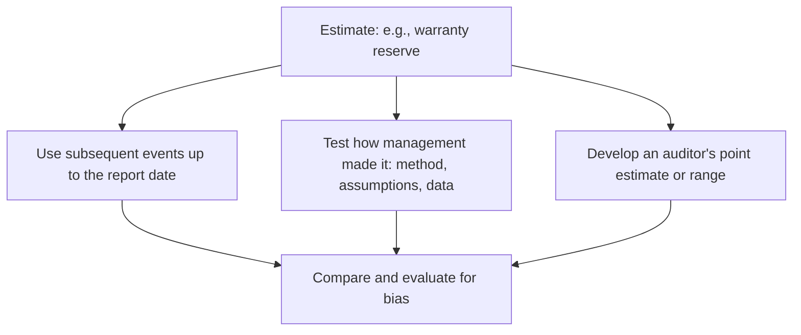

## Accounting estimates



**Indicators of management bias:** changes in assumptions that consistently move results toward management's goals; selecting a point estimate at the optimistic end of a range; assumptions that are inconsistent with each other or with industry data.

```worked
title: Evaluating a warranty reserve
scenario: |
  Management records a warranty reserve of $400,000. The auditor develops a range of $450,000–$600,000
  based on historical claims. Last year management's estimate was $350,000 and actual claims were $480,000.
steps:
  - label: Compare with the auditor's range
    work: 400,000 is below the 450,000 low end
    result: Misstatement of at least 50,000 (to the nearest point of the range)
  - label: Retrospective review
    work: Last year's estimate was 130,000 below actual claims
    result: Possible pattern of optimistic estimates — an indicator of bias
  - label: Response
    work: Accumulate the 50,000 misstatement; consider the bias indicator in evaluating other estimates and the statements as a whole
    result: Discuss with management and those charged with governance
insight: When management's estimate is outside the auditor's range, the misstatement is at least the distance to the nearest end of the range.
```

```check
aud-sr-chk1
```

## Related parties

| Step | Procedure |
|---|---|
| Understand | Ask management who the related parties are and about transactions with them; understand controls over authorizing them |
| Stay alert | Read minutes, contracts, bank confirmations, and legal letters for signs of undisclosed relationships (guarantees, loans at unusual terms, unusual year-end sales) |
| Respond | Significant transactions **outside the normal course of business** → significant risk: read the agreements, evaluate the business rationale, and check authorization |
| Evaluate | Proper accounting and disclosure; an "arm's-length" claim only if substantiated |

```check
aud-sr-chk2
```

## Laws and regulations

| Category | Examples | Auditor's responsibility |
|---|---|---|
| **Direct effect** on material amounts and disclosures | Income tax, pension law, grant terms | Obtain sufficient appropriate evidence of compliance |
| **Other** laws fundamental to operations | Environmental rules, occupational safety, licensing | Limited procedures: inquire of management and those charged with governance, inspect correspondence with regulators |

If noncompliance is suspected: understand the matter, discuss it with management (at least one level above those involved) and, when appropriate, TCWG; evaluate the effect on the statements (fines, contingencies); consider legal counsel; and consider withdrawal if the entity doesn't take remedial action.
