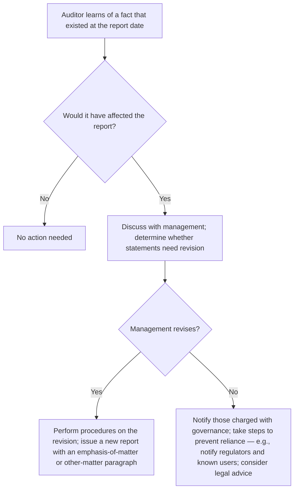

## The timeline

```timeline
title: Auditor's responsibilities after year-end
events:
  - when: December 31
    label: Balance sheet date
  - when: Jan 1 – March 1
    label: Active search for subsequent events
    detail: Inquiry, minutes, interim statements, legal letters, representations
  - when: March 1
    label: Report date
    detail: Date sufficient appropriate evidence obtained
  - when: March 1 – March 15
    label: No duty to search, but must respond to facts that become known
    detail: Dual-date or re-date if the statements are amended
  - when: March 15
    label: Report release date
  - when: After release
    label: Subsequently discovered facts; omitted procedures
    detail: Evaluate and act; possibly a new report or steps to prevent reliance
```

```check
aud-se-chk1
```

## Dual dating vs. re-dating

```worked
title: Choosing the report date
scenario: |
  Fieldwork ends and the report is dated March 1 (Year 2). On March 8, before release, a lawsuit that arose in
  Year 1 settles for more than accrued. Management revises the accrual and Note 12.
steps:
  - label: Option 1 — dual date
    work: "March 1, Year 2, except for Note 12, as to which the date is March 8, Year 2"
    result: Subsequent-events responsibility extends to March 8 only for Note 12
  - label: Option 2 — re-date
    work: Date the report March 8
    result: Subsequent-events procedures must be extended through March 8 for all events
insight: Dual dating limits the extra work; re-dating extends responsibility for everything.
```

## After the report is released



```check
aud-se-chk2
```

## Reviewing management's treatment of subsequent events

For each event, ask **when the underlying condition arose**:

- **Existed at the balance sheet date** (customer already in financial difficulty, a lawsuit about a prior-year event): adjust, for only the *incremental* amount beyond what was already recorded.
- **Arose after the balance sheet date** (a new competitor's price cut, a fire, a stock issuance): no adjustment; disclose if material.

Common management errors: accruing the full settlement instead of the increase over the existing accrual, and writing down assets for post-year-end declines. When management adds a disclosure after the report date but before release, the auditor either **dual-dates** the report for that note or **re-dates** it and extends the subsequent-events procedures to the new date.
