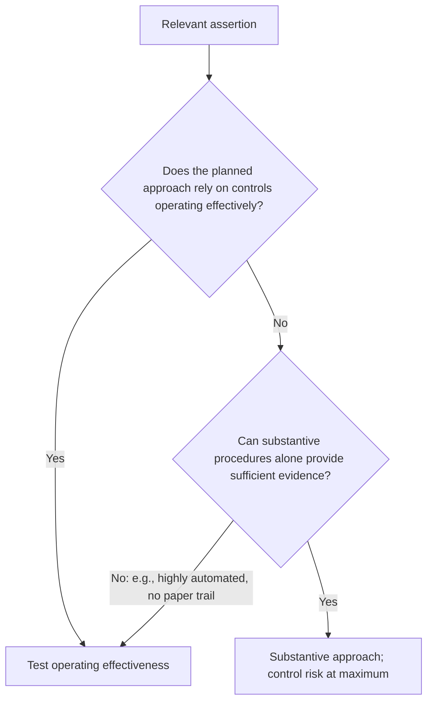

## When are tests of controls required?



```check
aud-toc-chk1
```

## How to test a control

| Control | Test |
|---|---|
| Manual approval of credit memos | **Inspect** a sample of credit memos for evidence of approval |
| Segregation of duties at the loading dock | **Observe** (and inquire), since it leaves no documentary trail |
| Monthly bank reconciliation reviewed by the controller | **Inspect** reconciliations for review evidence and **reperform** one |
| Automated three-way match | Test the configuration once (with effective ITGCs), or reperform with test data |

**Design vs. operating effectiveness:** A walkthrough shows whether a control is designed and implemented. Operating effectiveness requires evidence across the period of reliance.

## Using prior-year evidence

```worked
title: Can the auditor rely on last year's tests?
scenario: |
  Three controls at Ridge Foods were tested in Year 1 and are unchanged in Year 2.
steps:
  - label: Credit approval control (not related to a significant risk)
    work: Confirm no change (inquiry plus observation or inspection); rotate testing
    result: Prior-year evidence may be used — but test it at least once every third audit
  - label: Control over revenue cut-off — a significant risk
    work: Controls over significant risks must be tested in the current period if relied on
    result: Must be tested in Year 2
  - label: All other unchanged controls
    work: The auditor must test some controls each audit
    result: Rotate — not all controls can be skipped in the same year
insight: A control that changed must be retested this year, regardless of the rotation.
```

```check
aud-toc-chk2
```
