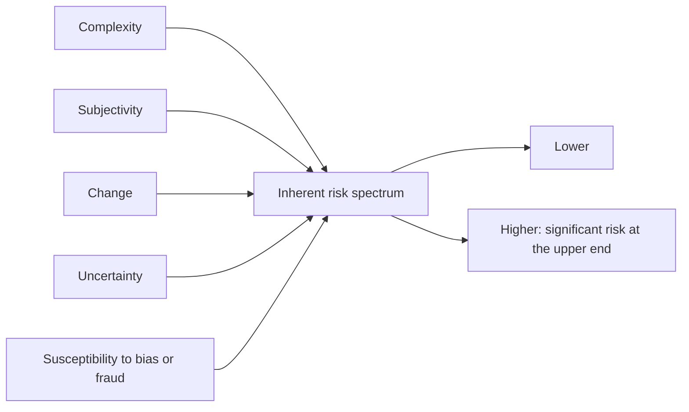

## What the auditor must understand

| Area | Examples of what to learn |
|---|---|
| Structure, ownership, governance | Subsidiaries, related parties, the board and audit committee |
| Business model and IT | Revenue streams, key customers, how IT is used in operations and reporting |
| External factors | Industry competition, regulation, economic conditions |
| Performance measures | KPIs, budgets, analyst expectations, bonus metrics |
| Accounting framework and policies | Revenue policies, estimates, changes in policies |

## Inherent risk factors



```check
aud-ue-chk1
```

## Levels of risk

| Level | Nature | Response |
|---|---|---|
| **Financial statement level** | Pervasive — affects many assertions (weak control environment, management integrity concerns, going concern pressure) | Overall responses: more experienced staff, more supervision, more skepticism, unpredictability, changes to timing |
| **Assertion level** | Specific (valuation of inventory, cut-off of revenue) | Further audit procedures designed for that assertion |

```worked
title: Placing risks on the spectrum
scenario: |
  Marlow Pharmaceuticals, Year 2. Three accounts are being assessed.
steps:
  - label: Cash (one bank account, simple reconciliations)
    work: Low complexity, subjectivity, change, and uncertainty
    result: Lower end of the spectrum
  - label: Litigation reserve for a new product-liability class action
    work: High uncertainty and subjectivity; susceptible to management bias
    result: Upper end — a significant risk
  - label: Revenue under a new rebate program
    work: Change and complexity in estimating variable consideration
    result: Elevated; the program's first year warrants focused procedures
insight: The factors explain why a risk is high. The auditor documents them because they drive the response.
```

```check
aud-ue-chk2
```

## Separate assessments and the stand-back

- **Inherent risk** is assessed for every relevant assertion.
- **Control risk** is assessed separately. If the auditor does not plan to test operating effectiveness, control risk is at **maximum** — the RMM then equals the inherent risk assessment.
- **Stand-back:** for material items where no relevant assertion was identified, re-evaluate that conclusion. Material items always get substantive procedures.
