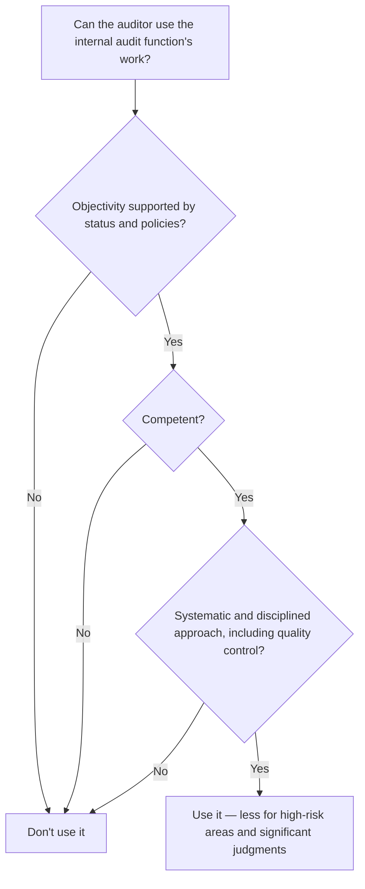

## Specialists

| | Auditor's specialist | Management's specialist |
|---|---|---|
| Engaged by | The auditor (internal or external to the firm) | The entity |
| Evaluate | Competence, capabilities, objectivity | Competence, capabilities, objectivity |
| Also | Agree on the scope, roles, and communications; evaluate the adequacy of the findings | Understand the work; evaluate its appropriateness as evidence (assumptions, methods, source data) |
| Referenced in report? | No (unless required by law, or relevant to a modification — with a statement that it doesn't reduce the auditor's responsibility) | No |

```check
aud-uo-chk1
```

## Internal audit function



The auditor must also **reperform** some of the work it uses, and it must make all significant judgments itself.

## Service organizations (SOC 1 reports)

| Report | Covers | Supports control reliance? |
|---|---|---|
| **Type 1** | Fair description and suitable design as of a specified date | Understanding only — not operating effectiveness |
| **Type 2** | Type 1 plus **operating effectiveness** over a period | Yes, if it covers the relevant controls and period |

```worked
title: Using a payroll processor's SOC 1 report
scenario: |
  Hartley Co. (calendar year) uses PayCore for payroll. PayCore provides a SOC 1 Type 2 report covering
  October 1, Year 0 – September 30, Year 1.
steps:
  - label: Is it the right type?
    work: Type 2 tests operating effectiveness
    result: Can support reliance on PayCore's controls
  - label: Does it cover the period?
    work: The report ends September 30; Hartley's year ends December 31
    result: Obtain a bridge letter from PayCore and other evidence for October–December
  - label: Complementary user entity controls
    work: The report assumes Hartley reviews payroll change reports
    result: Test that control at Hartley
  - label: Reference in the report?
    work: Unmodified opinion
    result: No reference to the service auditor
insight: A SOC report never covers the user entity's own controls; the user auditor tests those itself.
```

```check
aud-uo-chk2
```

## Group audits (component auditors)

In a group audit, the group engagement partner decides whether to **assume responsibility** for a component auditor's work (no reference in the report) or to **make reference** to the component auditor's report — indicating the division of responsibility. Either way, the group auditor evaluates the component auditor's independence, competence, and professional reputation.
