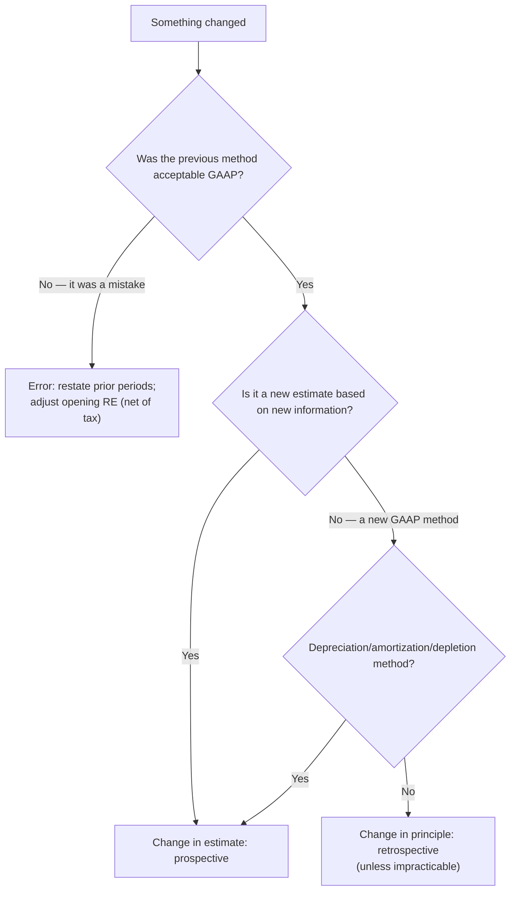

## Four kinds of change, three treatments

| Type | Example | Treatment |
|---|---|---|
| **Change in accounting principle** | FIFO → weighted average; completed-contract policy change under a new standard's transition | **Retrospective** application |
| **Change in accounting estimate** | New useful life, salvage value, bad debt percentage | **Prospective** |
| **Change in estimate effected by change in principle** | Straight-line → DDB depreciation | **Prospective** |
| **Change in reporting entity** | Presenting consolidated instead of individual statements | **Retrospective** |
| **Error correction** | Omitted depreciation; using cash basis instead of accrual; math error | **Restatement** (prior-period adjustment) |



> **Trap:** Changing from an unacceptable method (cash basis, not recording warranty accruals) to GAAP is an **error correction**, not a change in principle.

```check
far-chg-chk1
```

## Retrospective application

1. Recast every prior period **presented** as if the new principle had always been used.
2. Adjust the **opening retained earnings** (and other affected balances) of the **earliest** period presented for the cumulative effect of all earlier periods, **net of tax**.
3. Disclose the nature of and reason for the change (why the new principle is **preferable**) and its effects.

Only the **direct** effects are recognized; **indirect** effects (e.g., profit-sharing payments based on income) are recognized in the period of change.

```worked
title: Change from FIFO to weighted average
scenario: |
  At the start of Year 3, a company changes from FIFO to weighted average. It presents Year 2 and Year 3 statements.
  Pretax income would have been $50,000 lower in years before Year 2 and $8,000 lower in Year 2 under average cost.
  Tax rate 25%.
steps:
  - label: Adjustment to January 1, Year 2 retained earnings (earliest period presented)
    work: 50,000 × (1 − 0.25)
    result: Decrease of 37,500
  - label: Year 2 comparative statements
    work: Recast Year 2 net income lower by 8,000 × 0.75
    result: Year 2 net income restated down by 6,000
  - label: Year 3
    work: Apply weighted average in the normal course
    result: No cumulative-effect line on the income statement
insight: The old "cumulative effect of a change in accounting principle" line on the income statement no longer exists — everything flows through opening retained earnings.
```

## Error corrections

Errors discovered after the statements were issued are corrected by **restatement**:

- Restate prior periods presented; record a **prior-period adjustment** to the **opening retained earnings** of the earliest period presented, **net of tax**.
- Disclose the nature of the error and its effect on each line item and per-share amount.

**Counterbalancing errors** (e.g., inventory, accrued expenses) self-correct after two years. If discovered after the second year closes, no entry is needed — but the prior statements presented are still restated if they're shown.

```faded
title: Your turn — omitted depreciation
scenario: |
  In Year 3 (books for Year 2 closed), a company discovers that Year 2 depreciation of $40,000 was never recorded.
  Tax rate 25%. The company presents only Year 3 statements.
steps:
  - label: Prior-period adjustment to January 1, Year 3 retained earnings (enter a decrease as negative)
    answer: -30000
    solution: 40,000 × (1 − 0.25) = 30,000 decrease
  - label: Correction to accumulated depreciation (increase)
    answer: 40000
    solution: Dr Retained earnings 30,000; Dr Deferred tax asset or Income taxes receivable 10,000; Cr Accumulated depreciation 40,000
```

```check
far-chg-chk2
```
