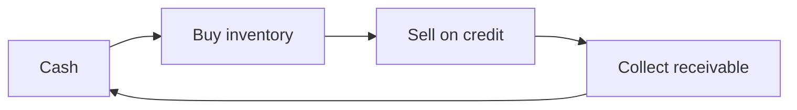

## Current vs. noncurrent: the one rule

An asset is **current** if it will be realized in cash, sold, or consumed **within one year or the normal operating cycle, whichever is longer**. The *operating cycle* is the average time from spending cash on inputs to collecting cash from customers.



Most businesses have cycles shorter than a year, so "one year" governs. Industries with long cycles (winemaking, lumber, construction) use the cycle.

**Typical current assets** (in order of liquidity): cash and cash equivalents → short-term investments → receivables → inventory → prepaid expenses.

**Not current:** cash restricted for a noncurrent purpose (e.g., a bond sinking fund), long-term investments, PP&E, intangible assets, cash surrender value of life insurance, and receivables from officers not expected to be collected soon.

**Current liabilities** are obligations whose settlement is expected to use current assets or create other current liabilities: accounts payable, accrued expenses, unearned revenue, dividends payable, and the **current portion of long-term debt**.

```check
far-bse-chk1
```

### Two classification traps

1. **Debt that is callable because of a covenant violation** at the balance sheet date is **current**, unless the lender has waived the right for more than a year (or the violation will be cured within the grace period).
2. **Offsetting**: you generally cannot net a receivable against a payable. Setoff is allowed only when a *right of setoff* exists — the amounts are determinable, owed between the two parties, the entity intends to set off, and the right is legally enforceable.

## Working capital

**Working capital = current assets − current liabilities.** It measures the cushion available to pay near-term obligations.

```worked
title: Classify and compute working capital
scenario: |
  At December 31, Harbor Co. reports: cash $40,000; accounts receivable $90,000; inventory $120,000;
  prepaid insurance (6 months) $6,000; land held for a future plant $200,000; accounts payable $70,000;
  accrued wages $10,000; a $300,000 note payable in equal annual installments of $60,000 beginning next July.
steps:
  - label: Identify current assets
    work: Cash 40,000 + receivables 90,000 + inventory 120,000 + prepaid 6,000. Land held for a future plant is a long-term investment, not current.
    result: 256,000
  - label: Identify current liabilities
    work: Accounts payable 70,000 + accrued wages 10,000 + current portion of the note 60,000 (the installment due within a year).
    result: 140,000
  - label: Subtract
    work: 256,000 − 140,000
    result: Working capital = 116,000
insight: The note is split — only the installment due within a year is current. Forgetting to reclassify it overstates working capital by 60,000.
```

## The statement of changes in equity

This statement (or a note) explains the change in **each component** of equity: common stock, preferred stock, additional paid-in capital (APIC), retained earnings, accumulated other comprehensive income (AOCI), treasury stock, and noncontrolling interest.

Retained earnings follows a simple roll-forward:

| Line | Effect |
|---|---|
| Beginning retained earnings, as previously reported | |
| ± Prior-period adjustments (error corrections), **net of tax** | restates the opening balance |
| = Beginning retained earnings, as adjusted | |
| + Net income (− net loss) | |
| − Dividends **declared** (cash, property, stock) | declared, not paid |
| = Ending retained earnings | |

```tacct
title: Retained earnings for the year
accounts:
  - name: Retained earnings
    debits:
      - { label: Error correction (net of tax), amount: 14000 }
      - { label: Dividends declared, amount: 50000 }
    credits:
      - { label: Beginning balance, amount: 400000 }
      - { label: Net income, amount: 130000 }
```

Ending balance: 400,000 − 14,000 + 130,000 − 50,000 = **466,000** credit.

```faded
title: Your turn — retained earnings roll-forward
scenario: |
  Beginning retained earnings were $820,000. During the year the company discovered that prior-year depreciation
  had been understated by $30,000 (tax rate 25%). Net income was $210,000. The board declared cash dividends of
  $80,000, of which $60,000 was paid before year-end.
steps:
  - label: Prior-period adjustment, net of tax
    work: Understated depreciation means prior income was overstated, so retained earnings must decrease by the after-tax amount.
    answer: 22500
    hint: 30,000 × (1 − 0.25)
    solution: 30,000 × 0.75 = 22,500 decrease.
  - label: Adjusted beginning retained earnings
    answer: 797500
    hint: 820,000 − the adjustment
    solution: 820,000 − 22,500 = 797,500.
  - label: Ending retained earnings
    answer: 927500
    hint: Dividends reduce retained earnings when declared, not when paid.
    solution: 797,500 + 210,000 − 80,000 = 927,500. The $20,000 unpaid is a dividend payable (a current liability).
```

```check
far-bse-chk2
```

## Where other equity changes appear

- **Other comprehensive income** items (e.g., unrealized gains/losses on available-for-sale debt securities, foreign currency translation, certain pension items) flow into **AOCI**, not retained earnings.
- **Treasury stock** is a contra-equity account (reduces total equity); it is never an asset.
- **Stock dividends** move amounts from retained earnings to common stock/APIC — total equity does not change.
- **Noncontrolling interest** (in consolidated statements) is presented within equity, separately from the parent's equity.

## Agreeing draft statements to source data

Reviewing a draft set of statements is a checklist exercise. Start with the **cross-checks** — they tell you *that* something is wrong — then trace individual lines to find *what*:

1. Does total assets equal total liabilities and equity?
2. Does net income on the income statement equal net income in retained earnings?
3. Does ending retained earnings and AOCI on the equity statement equal the balance sheet?
4. Does ending cash on the cash flow statement equal the balance sheet?

Then trace line by line to the trial balance. Typical discrepancies:

| Discrepancy | Effect |
|---|---|
| Receivables shown gross instead of net of the allowance | Assets overstated; statement does not balance |
| Current portion of long-term debt left in noncurrent | Current liabilities understated; total liabilities unchanged |
| OCI item (for example, an unrealized gain on AFS debt securities) reported in net income | Net income and retained earnings overstated; AOCI understated; **total equity unchanged** |
| Dividends deducted as an expense | Net income understated; ending retained earnings unchanged |

Notice the last two rows: some errors leave a subtotal correct. That is why you must check the **components**, not only the totals.
