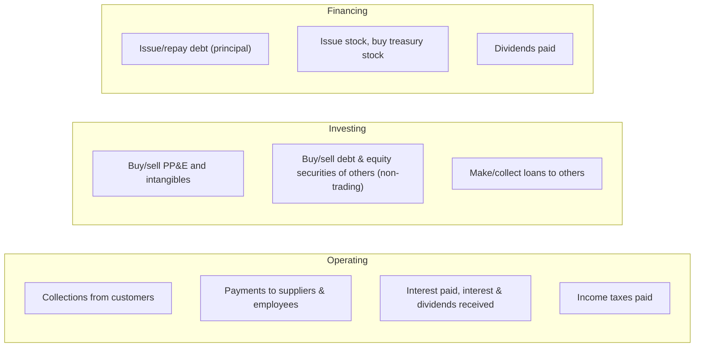

## The three buckets



The logic to memorize: **transactions with owners and lenders about capital are financing — except interest paid, which is operating** because it runs through net income. Dividends *received* and interest *received* are operating for the same reason.

| Item | Section |
|---|---|
| Purchase of trading securities | Operating (bought for resale) |
| Proceeds from sale of equipment | Investing (full proceeds) |
| Principal payment on a finance lease liability | Financing |
| Cash paid to settle zero-coupon debt: interest portion | Operating |
| Debt prepayment or extinguishment costs | Financing |
| Proceeds from insurance on a destroyed building | Investing (classify by the nature of the loss) |
| Distributions from an equity-method investee | Operating up to cumulative earnings; excess is investing (cumulative-earnings approach) |

```check
far-scf-chk1
```

## The indirect method

Start with net income and undo everything that was not cash:

1. **Add back noncash expenses**: depreciation, amortization, impairment, bad debt expense (if using gross receivables), deferred tax expense.
2. **Remove gains, add back losses** from investing/financing transactions (the cash lives in those sections).
3. **Adjust for changes in operating assets and liabilities**:

| Change | Adjustment to net income | Why |
|---|---|---|
| Accounts receivable ↑ | Subtract | Revenue recorded but not collected |
| Inventory ↑ | Subtract | Cash spent on goods not yet expensed |
| Prepaid expenses ↑ | Subtract | Cash paid ahead of expense |
| Accounts payable ↑ | Add | Expense recorded but not yet paid |
| Accrued liabilities ↑ | Add | Same |
| Unearned revenue ↑ | Add | Cash collected ahead of revenue |

Memory hook: **assets move opposite, liabilities move the same** as their effect on cash.

```worked
title: Indirect method from scratch
scenario: |
  Ridge Co. net income $150,000. Depreciation $40,000. Gain on sale of equipment $12,000 (proceeds $30,000).
  Accounts receivable increased $25,000; inventory decreased $10,000; accounts payable increased $8,000;
  wages payable decreased $3,000.
steps:
  - label: Start with net income
    work: Net income
    result: 150,000
  - label: Add noncash expense and remove the gain
    work: +40,000 depreciation − 12,000 gain
    result: 178,000
  - label: Working-capital changes
    work: −25,000 (AR up) + 10,000 (inventory down) + 8,000 (AP up) − 3,000 (wages payable down) = −10,000
    result: 168,000
  - label: Operating cash flow
    work: 178,000 − 10,000
    result: Net cash provided by operating activities = 168,000
insight: The $30,000 sale proceeds appear in investing activities. Removing the $12,000 gain prevents counting part of that cash twice.
```

```faded
title: Your turn — indirect method
scenario: |
  Net income $90,000. Amortization of a patent $6,000. Loss on sale of investments $4,000.
  Accounts receivable decreased $7,000. Prepaid rent increased $2,000. Accounts payable decreased $11,000.
  Income taxes payable increased $5,000.
steps:
  - label: Net income plus noncash items and the loss
    answer: 100000
    hint: Amortization and losses are added back.
    solution: 90,000 + 6,000 + 4,000 = 100,000
  - label: Net working-capital adjustment
    answer: -1000
    hint: AR down = add; prepaid up = subtract; AP down = subtract; taxes payable up = add.
    solution: +7,000 − 2,000 − 11,000 + 5,000 = −1,000
  - label: Net cash from operating activities
    answer: 99000
    solution: 100,000 − 1,000 = 99,000
```

## The direct method

The direct method lists gross operating receipts and payments. The workhorse computation is **cash collected from customers**:

> Cash collected = Sales + beginning AR − ending AR (using net AR, subtract write-offs only if working from gross AR)

Similarly, **cash paid to suppliers** = COGS + increase in inventory − increase in accounts payable.

The FASB *encourages* the direct method, but if an entity uses it, it must **also** present a reconciliation of net income to operating cash flow (effectively the indirect method) in a separate schedule.

```check
far-scf-chk2
```

## Disclosures that trip people up

- **Noncash investing and financing activities** — acquiring a building by issuing a mortgage, converting debt to equity, obtaining a right-of-use asset for a lease liability — are disclosed in a narrative or schedule, **not** in the body of the statement.
- **Interest paid (net of amounts capitalized) and income taxes paid** must be disclosed when the indirect method is used.
- **Cash, cash equivalents, and restricted cash** are all included in the beginning and ending totals; transfers between them are not cash flows.

## Reviewing a draft statement of cash flows

The fastest check: **beginning cash + net change = ending cash on the balance sheet**. If that fails, go line by line. The errors examiners seed most often:

| Error | Correct treatment |
|---|---|
| Gain on sale **added** in operating activities | **Subtract** the gain; report the full proceeds in investing |
| Carrying amount reported as sale proceeds | Report the cash received |
| Sign of a working-capital change reversed | Increase in a current operating asset → **subtract**; increase in a current operating liability → **add** |
| Noncash acquisition (asset for a note or stock) included in investing and financing | Exclude it from the statement; disclose it as a noncash investing and financing activity |
| Interest or dividends paid in the wrong section (US GAAP) | Interest paid → operating; dividends paid → financing |

When you correct one line, carry the correction through the section subtotal and the net change in cash. A single noncash transaction included by mistake often shows up **twice** — once in investing and once in financing.
