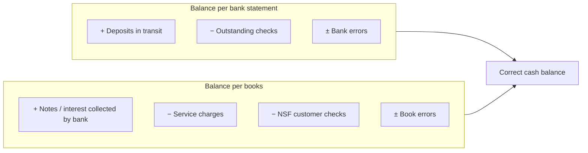

## What counts as cash and cash equivalents?

| Included | Excluded (and where it goes) |
|---|---|
| Currency and coins, petty cash | Postdated checks received → receivable |
| Checking and savings deposits | IOUs from employees, travel advances → receivable/prepaid |
| Customer checks received, not yet deposited | NSF (bounced) checks → receivable |
| Money orders, cashier's and certified checks | Postage stamps → prepaid expense |
| **Cash equivalents**: T-bills, commercial paper, money market funds with **original maturity to the holder ≤ 3 months** | CD or T-bill with original maturity > 3 months → short-term investment |
| | Compensating balance that is legally restricted, sinking fund → reported separately (restricted cash) |

> **Trap:** "Original maturity **to the holder**." A 3-year Treasury note bought **two months** before it matures is a cash equivalent. A 6-month T-bill bought when issued is not — even when only one month remains at year-end.

```check
far-cash-chk1
```

## Bank reconciliation

The goal: find the **correct cash balance** from both directions.



Why the sides: the bank hasn't heard about deposits in transit and outstanding checks yet (the books already have them). The books haven't heard about bank charges, collections, and bounced checks yet (the bank already processed them). **Only book-side items need entries.**

```worked
title: Reconcile and adjust
scenario: |
  June 30: balance per bank $46,200; balance per books $44,880. Deposits in transit $5,600.
  Outstanding checks $7,300. Bank collected a note receivable for the company: $1,000 principal + $50 interest.
  Service charges $40. NSF customer check $760. The company recorded check #512 for supplies as $290;
  the check was actually written and cleared for $920.
steps:
  - label: Correct balance — bank side
    work: 46,200 + 5,600 − 7,300
    result: 44,500
  - label: Correct balance — book side
    work: '44,880 + 1,050 (note + interest) − 40 (fees) − 760 (NSF) − 630 (check error: 920 − 290)'
    result: 44,500
  - label: Do they agree?
    work: 44,500 = 44,500
    result: Reconciled — the correct June 30 cash balance is 44,500
insight: If the two sides don't agree, don't force it. A remaining difference is a signal of an unrecorded item or an error — exactly what the reconciliation is designed to catch.
```

```faded
title: Your turn — a reconciliation that ties
scenario: |
  Balance per bank $28,400. Balance per books $27,555. Deposits in transit $3,100. Outstanding checks $4,250.
  Interest earned credited by the bank $45. Service charge $30. NSF check from a customer $500.
  A $1,200 deposit was recorded in the books as $1,020.
steps:
  - label: Correct balance (bank side)
    answer: 27250
    solution: 28,400 + 3,100 − 4,250 = 27,250
  - label: Book-side adjustment for the deposit error
    answer: 180
    hint: The deposit was under-recorded.
    solution: 1,200 − 1,020 = 180 increase
  - label: Correct balance (book side)
    answer: 27250
    hint: Books + interest − service charge − NSF + deposit correction
    solution: 27,555 + 45 − 30 − 500 + 180 = 27,250 — it agrees with the bank side.
  - label: Net adjustment to the Cash account from book-side entries
    answer: -305
    solution: +45 − 30 − 500 + 180 = −305 (27,555 → 27,250)
```

```check
far-cash-chk2
```

## Adjusting entries from the book side

For each book-side reconciling item, record an entry, e.g.:

```je
title: Recording an NSF check and a service charge
lines:
  - { account: Accounts receivable, debit: 760 }
  - { account: Bank service charge expense, debit: 40 }
  - { account: Cash, credit: 800 }
memo: Bank-side items (deposits in transit, outstanding checks) need no entries — they will clear on their own.
```
