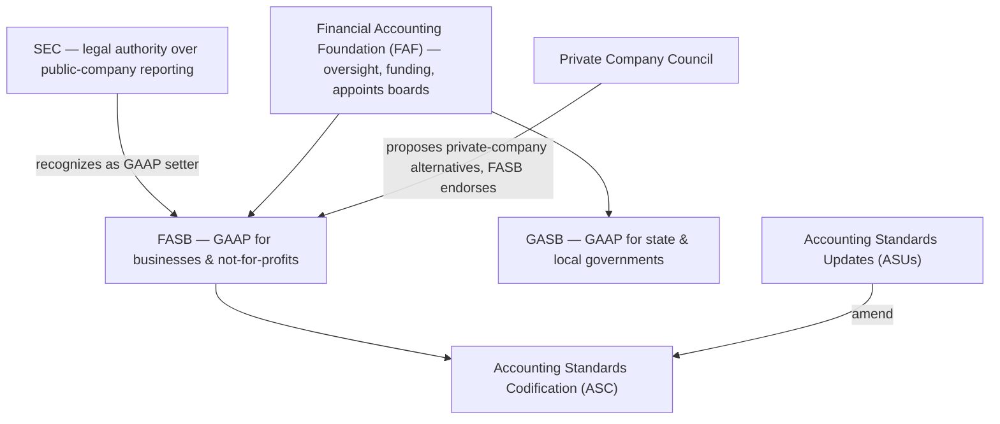
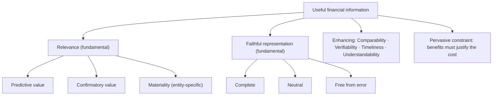

## Who writes the rules?

Think of standard setting as a chain of authority:



- **FASB** (Financial Accounting Standards Board) sets GAAP for businesses and not-for-profits.
- **GASB** sets GAAP for state and local governments. (Federal government reporting is a separate body, FASAB — rarely tested.)
- **FAF** oversees both boards; it does **not** write standards.
- **SEC** has statutory authority over public-company reporting. It generally lets the FASB set GAAP, but SEC rules and interpretive releases are **also authoritative for SEC registrants**.
- **PCC** recommends simpler alternatives for private companies (for example, amortizing goodwill); they become GAAP only when the FASB endorses them.

**Due process.** New GAAP arrives as an **Accounting Standards Update (ASU)** after agenda setting, research, an exposure draft, public comment, and redeliberation. An ASU is not itself authoritative; it *amends the Codification*, which is.

### What is (and isn't) authoritative

| Authoritative for a nonpublic business | Authoritative additionally for SEC registrants | Not authoritative |
|---|---|---|
| FASB Codification (ASC) | SEC rules, regulations, interpretive releases, and staff guidance | Concepts Statements, IFRS, textbooks, AICPA issues papers, industry practice |

When the Codification doesn't address a transaction, preparers first look for guidance on **similar** transactions in the Codification, and only then to nonauthoritative sources (Concepts Statements first among them).

```check
far-cf-chk1
```

## Finding your way around the Codification

Every Codification reference reads **Topic–Subtopic–Section–Paragraph**. `ASC 842-20-25-1` means Topic 842 (Leases), Subtopic 20 (Lessee), Section 25 (Recognition), paragraph 1.

Topics are grouped by the first digit:

| Topic range | Area | Example |
|---|---|---|
| 100s | General principles | 105 GAAP |
| 200s | Presentation | 230 Cash flows, 250 Accounting changes, 260 EPS |
| 300s | Assets | 330 Inventory, 350 Goodwill & intangibles, 360 PP&E |
| 400s | Liabilities | 450 Contingencies, 470 Debt |
| 500s | Equity | 505 Equity |
| 600s | Revenue | 606 Revenue from contracts with customers |
| 700s | Expenses | 740 Income taxes |
| 800s | Broad transactions | 820 Fair value, 842 Leases |
| 900s | Industry | 958 Not-for-profit entities |

The **section number** is the part that saves time on the exam, because it is the same in every topic:

| Section | Contents |
|---|---|
| -05 | Overview and background |
| -10 | Objectives |
| -15 | Scope and scope exceptions |
| -20 | Glossary |
| **-25** | **Recognition** — *whether and when* to record |
| **-30** | **Initial measurement** — *at what amount* at first |
| **-35** | **Subsequent measurement** — how the amount changes later |
| -40 | Derecognition |
| **-45** | **Other presentation matters** |
| **-50** | **Disclosure** |
| -55 | Implementation guidance and illustrations |
| -65 | Transition |

> **Exam habit:** turn the question into a verb. "When do we record it?" → -25. "At what amount?" → -30. "How do we report it later?" → -35. "What goes in the notes?" → -50.

## Who are financial statements for, and what makes them useful?

**Objective (CON 8, Ch. 1):** provide financial information that helps **existing and potential investors, lenders, and other creditors** decide whether to provide resources to the entity. Management, regulators, and employees may use the statements too, but they are not the *primary* users the standards are written for.

**Qualitative characteristics (CON 8, Ch. 3):**



Two traps the exam loves:

1. **Materiality is an aspect of relevance**, judged for the specific entity — there is no bright-line percentage in the framework.
2. **"Free from error" does not mean perfectly accurate.** An estimate is free from error if it is clearly described and the process used to develop it is applied without errors.

Also note what's *missing*: **conservatism and prudence are not qualitative characteristics** — deliberately understating assets would violate *neutrality*. "Reliability" was replaced by faithful representation.

```check
far-cf-chk2
```

## The elements: what actually goes on the statements

CON 8 Chapter 4 defines the building blocks. The two definitions everything else hangs on:

- **Asset:** a **present right** of an entity **to an economic benefit**.
- **Liability:** a **present obligation** of an entity **to transfer an economic benefit**.

Everything else is derived: **equity** is the residual (assets − liabilities); **revenues and gains** increase equity (other than owner investments); **expenses and losses** decrease it (other than distributions to owners); **comprehensive income** is all changes in equity from non-owner sources.

| Situation | Asset or liability now? | Why |
|---|---|---|
| Signed purchase order for next month's inventory (nothing delivered or paid) | Generally no (executory contract) | Neither party has performed yet |
| Board votes to build a new plant next year | No | A plan or intention is not a present right or obligation |
| Customer paid in advance for a service not yet provided | **Liability** | Present obligation to deliver the service |
| Legal right to use a leased warehouse | **Asset** (right-of-use) | Present right to economic benefit, controlled |

**Recognition** (putting an item into the statements, not just the notes) requires that the item meets an element definition, can be measured with a relevant measurement attribute, and can be faithfully represented — subject to materiality and the cost constraint.

## Underlying assumptions still worth knowing

- **Economic entity** — the business is separate from its owners.
- **Going concern** — assume the entity continues. Under ASC 205-40, management must evaluate whether there is **substantial doubt** about the entity's ability to continue as a going concern **within one year after the date the financial statements are issued** (or available to be issued) and disclose accordingly.
- **Monetary unit** and **periodicity** — measure in a stable currency, over artificial periods.
- **Accrual basis** — record revenues when earned and expenses when incurred, not when cash moves.

## Putting it together

When the exam hands you an unfamiliar situation, walk this chain: *Does it meet an element definition? → Can it be measured relevantly and faithfully? → Is it material? → Where would the Codification address it (which section number)?* That chain is the conceptual framework doing its job.
