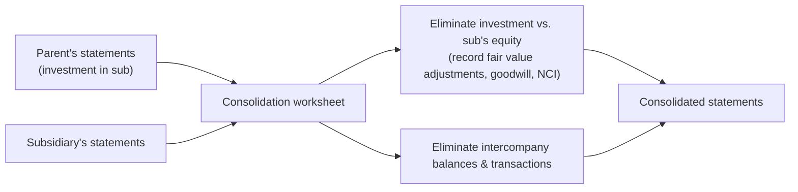

## When do you consolidate?

Under the **voting interest model**, a parent consolidates any entity in which it has a **controlling financial interest** — usually **ownership of more than 50%** of the outstanding voting shares. Consolidation is required even if the subsidiary's business is very different from the parent's.

Exceptions (rare on FAR): control is temporary, or control does not rest with the majority owner (e.g., the subsidiary is in legal reorganization or bankruptcy). Variable-interest-entity analysis is tested in BAR.

| Ownership / influence | Typical accounting |
|---|---|
| Less than 20%, no significant influence | Fair value (equity securities) |
| 20%–50%, significant influence | Equity method |
| More than 50% (control) | **Consolidate** |

## The mechanics in one picture



Consolidation happens **on a worksheet**; neither company's own books change.

## Intercompany eliminations — always 100%

Even if the parent owns 80%, eliminate **all** of the intercompany amount (the NCI simply absorbs its share of the subsidiary-side effects).

### 1. Receivables and payables, interest, and dividends

```je
title: Intercompany loan of $200,000 at 6%, one year outstanding
lines:
  - { account: Note payable (to parent), debit: 200000 }
  - { account: Interest revenue, debit: 12000 }
  - { account: Note receivable (from sub), credit: 200000 }
  - { account: Interest expense, credit: 12000 }
memo: Also eliminate any interest receivable/payable. Dividends the sub paid the parent are eliminated against the parent's dividend (or investment) income.
```

### 2. Intercompany inventory sales

Eliminate the whole internal sale from both revenue and cost of goods sold, then remove the **unrealized profit** in the buyer's ending inventory.

```worked
title: Downstream inventory sale
scenario: |
  Parent sells goods costing $60,000 to its subsidiary for $80,000. At year-end the subsidiary still holds
  25% of the goods; the rest were sold to outside customers.
steps:
  - label: Eliminate the internal sale
    work: Dr Sales 80,000 / Cr Cost of goods sold 80,000
    result: Consolidated sales and COGS each fall by 80,000
  - label: Intercompany gross profit
    work: 80,000 − 60,000
    result: 20,000 (25% markup on cost; 25% of the selling price)
  - label: Unrealized profit in ending inventory
    work: 20,000 × 25% still held
    result: 5,000
  - label: Defer it
    work: Dr Cost of goods sold 5,000 / Cr Inventory 5,000
    result: Consolidated inventory is carried at the group's original cost; consolidated gross profit falls by 5,000
insight: The 75% that reached outside customers produced real, consolidated profit. Only the profit on goods still inside the group is unrealized.
```

```check
far-con-chk1
```

### 3. Intercompany sales of PP&E

Treat the asset as if it never left the original owner:

1. Eliminate the **gain** (or loss) on the internal sale.
2. Restore the asset's **original cost and accumulated depreciation**.
3. Each year, remove the **excess depreciation** the buyer records on the marked-up amount — this gradually "realizes" the deferred gain.

```faded
title: Your turn — intercompany equipment sale
scenario: |
  On January 1, Year 1, Sub sold equipment to Parent for $90,000. Sub's cost was $100,000 and accumulated
  depreciation was $30,000. Parent depreciates it straight-line over the remaining 5 years, no salvage.
steps:
  - label: Gain eliminated in Year 1
    answer: 20000
    solution: 90,000 − (100,000 − 30,000) = 20,000
  - label: Parent's annual depreciation
    answer: 18000
    solution: 90,000 ÷ 5 = 18,000
  - label: Depreciation based on the group's carrying amount
    answer: 14000
    solution: 70,000 ÷ 5 = 14,000
  - label: Excess depreciation eliminated each year
    answer: 4000
    solution: 18,000 − 14,000 = 4,000 (5 years × 4,000 = the 20,000 gain, realized over the asset's life)
  - label: Net unrealized gain remaining at December 31, Year 1
    answer: 16000
    solution: 20,000 − 4,000 = 16,000 (carrying amount 72,000 on Parent's books vs. 56,000 for the group)
```

## Consolidated income and the NCI

- **Consolidated net income** = parent's income from its own operations + subsidiary's income, after eliminations (the parent's equity-method or dividend income from the sub is eliminated).
- **NCI share** = NCI % × subsidiary's income (adjusted for eliminations on sales *by the subsidiary* — "upstream" sales).
- Present consolidated net income, then attribute it: "net income attributable to noncontrolling interest" and "net income attributable to parent."

```check
far-con-chk2
```

## Reviewing a consolidation

When you review a consolidation worksheet, check each consolidated line against a simple formula: **parent + subsidiary + fair value adjustments − intercompany items**.

| Line | Check |
|---|---|
| Sales and COGS | Intercompany sales removed from **both** |
| COGS and inventory | Unrealized profit in ending inventory deferred: goods still held × seller's gross margin |
| Receivables and payables | Intercompany balances removed from **both** sides |
| Dividend or investment income | Dividends from the subsidiary eliminated |
| Operating expenses | Amortization of acquisition-date fair value adjustments added |
| Noncontrolling interest in net income | NCI % × (subsidiary net income − amortization − **upstream** unrealized profit) |

**At the acquisition date**, check that goodwill is **full** goodwill (consideration + fair value of NCI − fair value of identifiable net assets), that NCI is at fair value, that identifiable intangibles the subsidiary never recorded (customer relationships, trade names) are recognized, and that the subsidiary's equity is eliminated.

A worksheet that eliminates only one side of an intercompany balance cannot balance. That imbalance is a clue, not a rounding issue.
