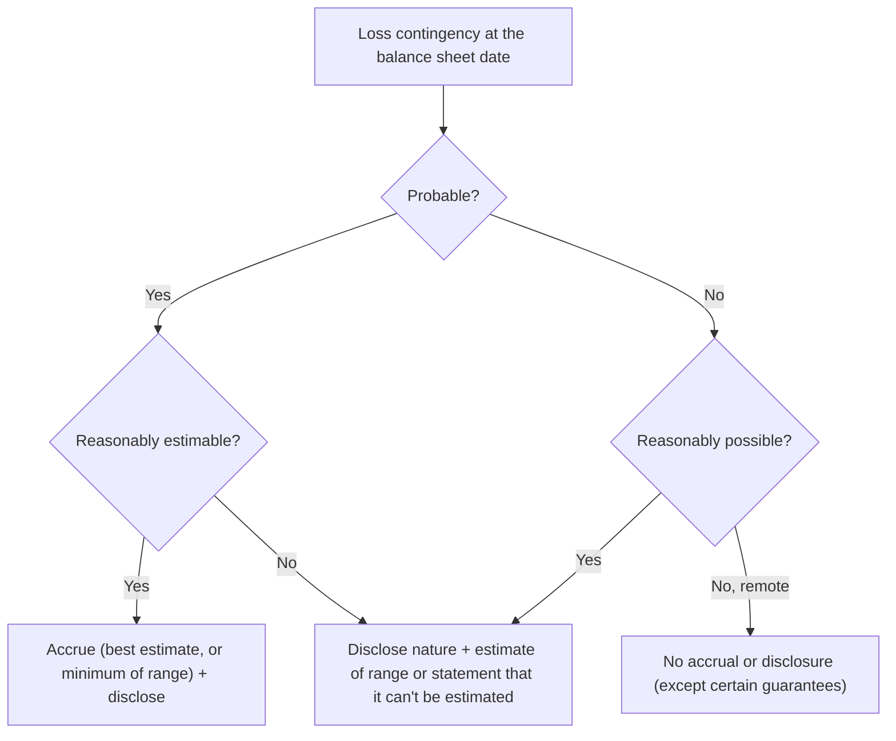

## The probability grid

| Likelihood | Reasonably estimable | Not estimable |
|---|---|---|
| **Probable** (likely to occur) | **Accrue** + disclose | Disclose |
| **Reasonably possible** (more than remote, less than likely) | Disclose | Disclose |
| **Remote** (slight) | Nothing* | Nothing* |

\*Certain guarantees are disclosed even when remote.



The condition must exist **at the balance sheet date**; information after year-end (before issuance) can help estimate it (see Subsequent Events).

```check
far-cont-chk1
```

## Ranges

```worked
title: Accruing a range of loss
scenario: |
  Legal counsel concludes a loss from a lawsuit is probable. Case 1: the range is $400,000 to $900,000 and
  $600,000 is the best estimate. Case 2: the range is $400,000 to $900,000 and no amount is more likely.
steps:
  - label: Case 1 — accrue
    work: Best estimate within the range
    result: 600,000 accrued; disclose the reasonably possible additional 300,000
  - label: Case 2 — accrue
    work: No best estimate → use the minimum
    result: 400,000 accrued; disclose the reasonably possible additional 500,000
insight: IFRS would use the midpoint (650,000) in Case 2 — a classic U.S. GAAP vs. IFRS comparison.
```

## Warranties and guarantees

**Assurance-type warranties** are loss contingencies accrued at the time of sale:

```faded
title: Your turn — warranty liability
scenario: |
  A company began selling appliances with a 2-year assurance warranty this year. Sales were $2,000,000;
  estimated warranty costs are 3% of sales. Actual warranty repairs paid this year were $22,000.
steps:
  - label: Warranty expense for the year
    answer: 60000
    solution: 2,000,000 × 3% = 60,000 (recognized in the year of sale)
  - label: Warranty liability at year-end
    answer: 38000
    solution: 60,000 − 22,000 paid = 38,000
```

**Guarantees** of others' debt: at inception, recognize a liability for the **fair value of the stand-ready obligation** (ASC 460), even if payment isn't probable. If a payment later becomes probable and estimable, apply ASC 450.

## Gain contingencies

Don't recognize until **realized or realizable** — e.g., a lawsuit the company expects to win, a pending tax refund claim. Disclosure is allowed but must avoid misleading implications about likelihood.

## Commitments

- **Unconditional purchase obligations** (take-or-pay contracts): disclose.
- **Firm purchase commitments** that are non-cancelable: if the market price falls below the contract price, recognize a **loss** and liability now.
- Other commitments (capital expenditures, employment contracts) are disclosed if significant.

```check
far-cont-chk2
```
