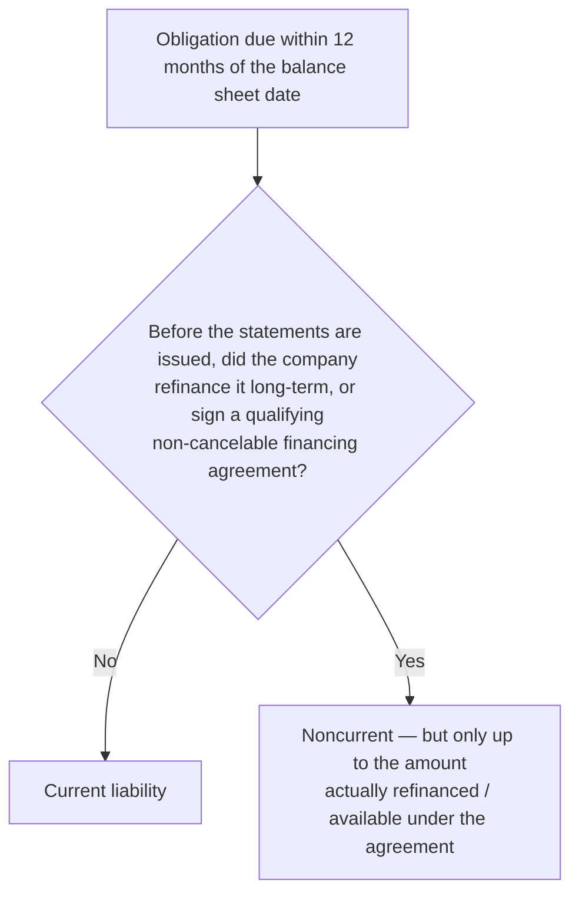

## Notes payable at present value

When a note is exchanged for property, goods, or services and has **no stated interest** or an **unreasonably low** rate, record it at the **fair value of the property or the present value of the note** at the market rate, whichever is more clearly determinable.

```worked
title: A noninterest-bearing note for equipment
scenario: |
  On January 1, a company buys equipment by signing a $150,000 note due in 3 years with no stated interest.
  The company's incremental borrowing rate is 9%. The equipment has no reliable cash price.
steps:
  - label: Present value of the note
    work: 150,000 × PV of 1 (9%, 3) = 150,000 × 0.77218
    result: 115,828 — equipment and note (net) are recorded at this amount
  - label: Discount on the note
    work: 150,000 − 115,828
    result: 34,172 — interest over three years
  - label: Year 1 interest expense
    work: 115,828 × 9%
    result: 10,425; note carrying amount 126,253 at year-end
insight: Recording the equipment at 150,000 would overstate the asset and understate interest expense by the same amount.
```

## Current or noncurrent?



**Refinancing traps**
- Intent alone is not enough — it must be **demonstrated** by an actual refinancing or a qualifying agreement **before issuance**.
- If short-term debt is **repaid** with cash after year-end and then new long-term debt is issued, the original obligation remains **current** (current assets were used).

**Callable debt**: long-term debt callable at the balance sheet date because of a covenant violation is **current**, unless the lender waives or loses the call right for more than one year, or it's probable the violation will be cured within a grace period.

```check
far-dbt-chk1
```

## Extinguishment

When debt is retired early (called, repurchased in the market):

> **Gain (loss) = net carrying amount − reacquisition price**

Net carrying amount = face ± unamortized premium/discount − unamortized debt issuance costs, updated to the extinguishment date.

```faded
title: Your turn — calling bonds
scenario: |
  A company calls $1,000,000 of bonds at 102. At the call date, the unamortized discount is $22,000 and
  unamortized debt issuance costs are $8,000 (both already updated to the call date).
steps:
  - label: Net carrying amount
    answer: 970000
    solution: 1,000,000 − 22,000 − 8,000 = 970,000
  - label: Reacquisition price
    answer: 1020000
    solution: 1,000,000 × 102% = 1,020,000
  - label: Gain (loss) on extinguishment — enter a loss as negative
    answer: -50000
    solution: 970,000 − 1,020,000 = (50,000) loss, reported in income from continuing operations
```

## Disclosures

For long-term debt: interest rates, maturity dates, restrictive covenants, collateral, and the **combined aggregate maturities for each of the next five years**. Unconditional purchase obligations and assets pledged as collateral are also disclosed.

```check
far-dbt-chk2
```
