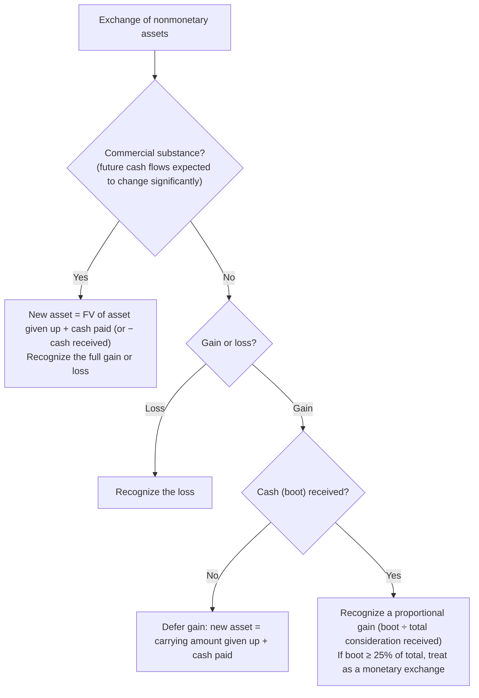

## Four methods, one asset

Asset: cost **$90,000**, salvage **$10,000**, life **5 years** (or 200,000 units).

| Method | Formula | Year 1 | Year 2 |
|---|---|---|---|
| Straight-line | (90,000 − 10,000) ÷ 5 | 16,000 | 16,000 |
| Double-declining balance | Carrying amount × 40% | 90,000 × 40% = **36,000** | 54,000 × 40% = **21,600** |
| Sum-of-the-years'-digits (SYD = 15) | 80,000 × remaining life ÷ 15 | 80,000 × 5/15 = **26,667** | 80,000 × 4/15 = **21,333** |
| Units of production (45,000 units in Year 1) | 80,000 ÷ 200,000 = $0.40/unit | 45,000 × 0.40 = **18,000** | depends on use |

> **DDB traps:** (1) the rate is applied to the **carrying amount** (cost − accumulated depreciation), not cost − salvage; (2) stop when the carrying amount reaches salvage.

**Partial years:** unless told otherwise, depreciate for the months held. Straight-line asset bought April 1: 16,000 × 9/12 = 12,000 in Year 1. For accelerated methods, each "depreciation year" straddles fiscal years — allocate each depreciation year's amount by months.

```check
far-dep-chk1
```

## Changes in estimate

When the useful life or salvage value changes, **don't touch past years**. Depreciate the **remaining carrying amount** (less new salvage) over the **remaining** life.

```worked
title: Revising useful life and salvage value
scenario: |
  Equipment cost $120,000, no salvage, 10-year straight-line life. After 4 years (accumulated depreciation
  $48,000), management concludes it will last only 4 more years and have a salvage value of $8,000.
steps:
  - label: Carrying amount at the change
    work: 120,000 − 48,000
    result: 72,000
  - label: New depreciable base
    work: 72,000 − 8,000
    result: 64,000
  - label: Year 5 depreciation
    work: 64,000 ÷ 4 remaining years
    result: 16,000
insight: A change in depreciation method (say, DDB to straight-line) is also handled prospectively — it's a change in estimate effected by a change in principle.
```

## Depletion of natural resources

Depletion base = acquisition cost + exploration and development costs + estimated restoration costs − residual value. Depletion rate = base ÷ estimated recoverable units; depletion = rate × units **extracted**. Depletion of units **sold** is expense; of units extracted but unsold, it stays in inventory.

## Disposals

1. Record depreciation up to the disposal date.
2. Remove cost and accumulated depreciation.
3. Gain or loss = proceeds − carrying amount.

```je
title: Sale of equipment — cost 50,000, accumulated depreciation 32,000, proceeds 15,000
lines:
  - { account: Cash, debit: 15000 }
  - { account: Accumulated depreciation, debit: 32000 }
  - { account: Loss on sale of equipment, debit: 3000 }
  - { account: Equipment, credit: 50000 }
```

## Nonmonetary exchanges



```faded
title: Your turn — an exchange with commercial substance
scenario: |
  A company trades in an old delivery van (cost $80,000, accumulated depreciation $50,000, fair value $36,000)
  and pays $10,000 cash for a new van. The exchange has commercial substance.
steps:
  - label: Carrying amount of the old van
    answer: 30000
    solution: 80,000 − 50,000 = 30,000
  - label: Gain (loss) on the exchange
    answer: 6000
    solution: Fair value 36,000 − carrying amount 30,000 = 6,000 gain (recognized)
  - label: Cost of the new van
    answer: 46000
    solution: 36,000 fair value given up + 10,000 cash = 46,000
  - label: Cost of the new van if the exchange LACKED commercial substance
    answer: 40000
    hint: Defer the gain — no cash was received.
    solution: 30,000 carrying amount + 10,000 cash = 40,000 (the 6,000 gain is deferred through a lower basis)
```

```check
far-dep-chk2
```
