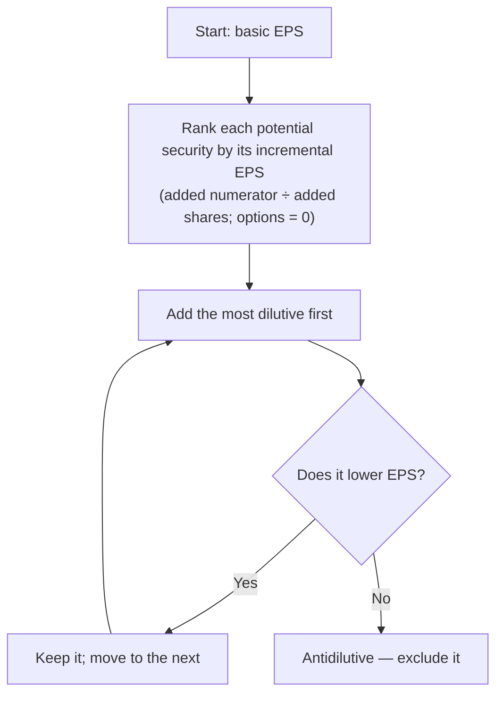

## Basic EPS

> **Basic EPS = (Net income − Preferred dividends) ÷ Weighted-average common shares outstanding**

### The numerator: preferred dividends

| Preferred stock is… | Subtract from net income |
|---|---|
| **Cumulative** | This year's dividend **whether or not declared** (dividends in arrears for *prior* years are not subtracted again) |
| **Noncumulative** | Only if **declared** this year |

### The denominator: weighted-average shares

Weight each share by the fraction of the year it was outstanding — **except** stock splits and stock dividends, which are treated as if they happened at the **beginning of the earliest period presented** (they change the number of slices, not the resources).

```timeline
title: Share activity for the year
events:
  - { when: Jan 1, label: '100,000 shares outstanding' }
  - { when: Apr 1, label: 'Issued 20,000 shares for cash' }
  - { when: Jul 1, label: '2-for-1 stock split', detail: 'Retroactive — restate everything before it' }
  - { when: Oct 1, label: 'Purchased 10,000 treasury shares (post-split)' }
```

```worked
title: Weighted-average shares
scenario: Use the timeline above for a calendar year.
steps:
  - label: Opening shares, restated for the split, outstanding 12 months
    work: 100,000 × 2 × 12/12
    result: 200,000
  - label: April issuance, restated for the split, outstanding 9 months
    work: 20,000 × 2 × 9/12
    result: 30,000
  - label: Treasury purchase, removed for 3 months
    work: −10,000 × 3/12 (already post-split)
    result: (2,500)
  - label: Total
    work: 200,000 + 30,000 − 2,500
    result: 227,500 weighted-average shares
insight: The split is not time-weighted. Doing so would suggest ownership changed on July 1, when nothing economic happened.
```

```check
far-eps-chk1
```

## Diluted EPS

Diluted EPS asks: *if every potentially dilutive security were converted, what would EPS be?* Only securities that **reduce** EPS are included.

### Options and warrants — treasury stock method

Assume exercise at the beginning of the year (or issue date, if later), and that the cash received is used to buy back shares at the **average market price** for the period:

> **Incremental shares = Shares under option − (Shares × Exercise price) ÷ Average market price**

If the average market price is **at or below** the exercise price, the options are **antidilutive** (out of the money) and are ignored.

### Convertible securities — if-converted method

| Security | Numerator | Denominator |
|---|---|---|
| Convertible preferred | **Add back** the preferred dividends that were subtracted | Add common shares issuable |
| Convertible bonds | **Add back interest expense, net of tax** | Add common shares issuable |

Assume conversion at the beginning of the year (or issuance date, if later).



```faded
title: Your turn — basic and diluted EPS
scenario: |
  Net income $500,000. 10,000 shares of 6%, $100 par **cumulative** preferred (no dividends declared this year).
  Weighted-average common shares 200,000. Options for 20,000 shares at $30; average market price $40.
  $1,000,000 of 5% bonds convertible into 30,000 common shares, outstanding all year. Tax rate 25%.
steps:
  - label: Basic EPS numerator
    answer: 440000
    hint: Cumulative preferred dividends are subtracted even if not declared.
    solution: 500,000 − (10,000 × 100 × 6% = 60,000) = 440,000
  - label: Basic EPS
    answer: 2.2
    tolerance: 0.01
    solution: 440,000 ÷ 200,000 = 2.20
  - label: Incremental shares from options
    answer: 5000
    hint: Proceeds = 20,000 × 30; buy back at 40.
    solution: 20,000 − (600,000 ÷ 40 = 15,000) = 5,000
  - label: After-tax interest added back for the bonds
    answer: 37500
    solution: 1,000,000 × 5% = 50,000 × (1 − 0.25) = 37,500 (incremental EPS 37,500 ÷ 30,000 = 1.25 — dilutive)
  - label: Diluted EPS
    answer: 2.03
    tolerance: 0.01
    solution: (440,000 + 37,500) ÷ (200,000 + 5,000 + 30,000) = 477,500 ÷ 235,000 = 2.03
```

## Presentation

- **Public entities** present **basic and diluted EPS on the face** of the income statement for **income from continuing operations and net income**. EPS for discontinued operations may be on the face or in the notes.
- Nonpublic entities are **not required** to present EPS.
- If there are no potentially dilutive securities, a single line ("basic and diluted") is fine.
- Reconcile the numerators and denominators of basic and diluted EPS in the notes.

```check
far-eps-chk2
```
