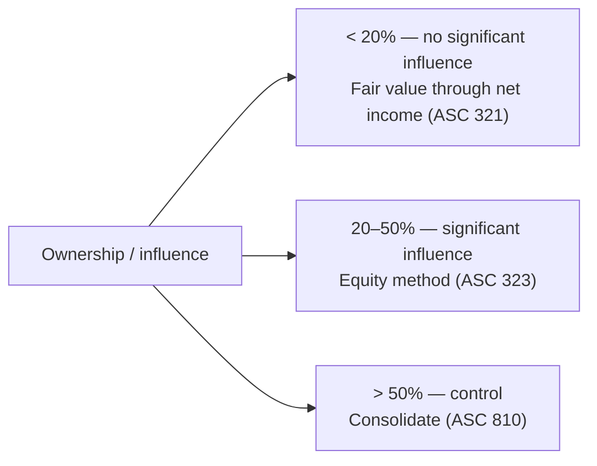

## Match the model to the influence



Percentages are only presumptions. **Significant influence** can exist below 20% (board seat, material intercompany transactions, interchange of managers, technological dependency) and can be absent above 20% (investee opposes the investor, another owner has control).

## Equity securities without significant influence

- **Readily determinable fair value**: carry at fair value; **unrealized gains and losses go to net income** (not OCI). Dividends received are dividend income.
- **No readily determinable fair value**: may elect the **measurement alternative** — cost, less impairment, adjusted up or down for **observable price changes** in orderly transactions for the identical or a similar investment of the same issuer.

> **Outdated-rule trap:** before 2018, "AFS equity securities" put changes in OCI. That category no longer exists for equity securities.

```check
far-eq-chk1
```

## The equity method

The investment account works like a mirror of the investor's share of the investee's equity:

```tacct
title: Investment in Investee (30% owned) — Year 1
accounts:
  - name: Investment in Investee
    debits:
      - { label: Cost, amount: 600000 }
      - { label: 30% of net income, amount: 120000 }
    credits:
      - { label: 30% of dividends, amount: 30000 }
      - { label: Excess depreciation, amount: 6000 }
```

```worked
title: Equity method with a basis difference
scenario: |
  On January 1, Investor buys 30% of Investee for $600,000. Investee's book value is $1,500,000. Investee's
  equipment (10-year remaining life) is worth $200,000 more than book value; any remaining excess is goodwill.
  Investee reports net income of $400,000 and pays dividends of $100,000.
steps:
  - label: Excess of cost over book value acquired
    work: 600,000 − (30% × 1,500,000 = 450,000)
    result: 150,000
  - label: Assign the excess
    work: Equipment 30% × 200,000 = 60,000 (amortize over 10 years = 6,000/yr); remainder 90,000 = goodwill (not amortized)
    result: 60,000 equipment + 90,000 goodwill
  - label: Equity in investee income
    work: 30% × 400,000 − 6,000 extra depreciation
    result: 114,000
  - label: Ending investment balance
    work: 600,000 + 114,000 − 30,000 dividends (30% × 100,000)
    result: 684,000
insight: Dividends reduce the investment — they're a return of the investor's share of earnings already recognized, not income.
```

### Intra-entity inventory profits

If the investee sells inventory to the investor (or vice versa) and some remains unsold at year-end, the investor defers **its share** of the unrealized profit: reduce equity income (and the investment) by ownership % × unrealized profit.

### Losses and other details

- If the investee has losses, the investment is reduced — but not below **zero** (unless the investor has guaranteed obligations or committed further support). Resume when the investee's income covers unrecognized losses.
- The investor records its share of the investee's **OCI** in its own OCI.
- If significant influence is later obtained (e.g., 10% → 25%), add the cost of the new shares to the existing basis and apply the equity method **prospectively**.
- The **fair value option** may be elected instead of the equity method (irrevocably, at initial recognition).

```faded
title: Your turn — equity method with intra-entity inventory
scenario: |
  Investor owns 40% of Investee (no basis difference). Investment balance January 1: $800,000. Investee's net
  income: $250,000; dividends declared and paid: $60,000. During the year Investee sold inventory to Investor at a
  $50,000 profit; Investor still holds 30% of it at year-end.
steps:
  - label: Investor's share of Investee net income
    answer: 100000
    solution: 40% × 250,000 = 100,000
  - label: Unrealized intra-entity profit to defer (Investor's share)
    answer: 6000
    solution: 50,000 × 30% still held = 15,000 × 40% = 6,000
  - label: Equity in investee income reported
    answer: 94000
    solution: 100,000 − 6,000 = 94,000
  - label: Investment balance at December 31
    answer: 870000
    solution: 800,000 + 94,000 − (40% × 60,000 = 24,000) = 870,000
```

```check
far-eq-chk2
```
