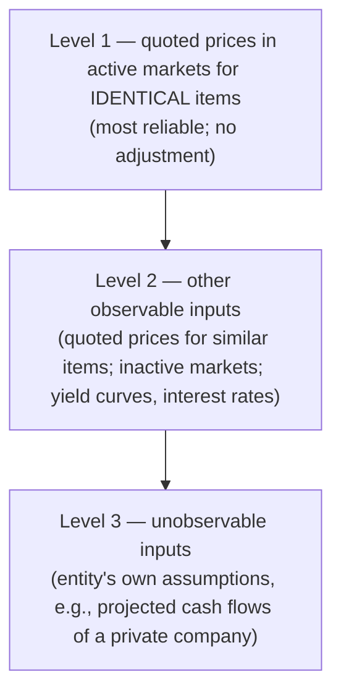

## The definition, piece by piece

> Fair value = the price that would be **received to sell an asset** or **paid to transfer a liability** in an **orderly transaction** between **market participants** at the **measurement date**.

- **Exit price** — not what you paid (entry price), though they're often equal at purchase.
- **Market participants** — independent, knowledgeable, able and willing buyers and sellers; not the entity's own intentions.
- **Orderly** — not a forced liquidation or distress sale.

## Which market, and which costs?

```worked
title: Principal vs. most advantageous market
scenario: |
  A commodity trades in two markets. Market A: price $30, transaction costs $3, transport costs $2.
  Market B: price $32, transaction costs $6, transport costs $2.
steps:
  - label: If Market A is the principal market (most volume)
    work: Price 30 − transport 2 (transaction costs are not deducted)
    result: Fair value = 28
  - label: If there is no principal market — find the most advantageous market
    work: "Net received: A = 30 − 3 − 2 = 25; B = 32 − 6 − 2 = 24"
    result: Market A is most advantageous
  - label: Fair value using Market A
    work: 30 − 2 transport
    result: Fair value = 28 (transaction costs used only to choose the market)
insight: Transaction costs belong to the transaction, not the asset. Transport costs change what the asset is worth at the market's location.
```

**Highest and best use** (nonfinancial assets only): value the asset in the use that market participants would choose — even if the company uses it differently. A warehouse on land zoned for condominiums may be worth more as a residential site.

```check
far-fv-chk1
```

## Valuation approaches and the hierarchy

| Approach | Idea | Example |
|---|---|---|
| **Market** | Prices of identical or comparable items | Quoted stock price; recent sales of similar buildings |
| **Income** | Convert future amounts to a present value | DCF model; option pricing models |
| **Cost** | Current replacement cost, adjusted for obsolescence | Specialized equipment |



A measurement is categorized at the **lowest level of any significant input**. Level 3 measurements require the most disclosure, including a reconciliation of beginning and ending balances and quantitative information about significant unobservable inputs.

```faded
title: Your turn — classify the inputs
scenario: |
  Use 1 for Level 1, 2 for Level 2, 3 for Level 3.
steps:
  - label: Shares of a stock traded on the NYSE, valued at the closing price
    answer: 1
    tolerance: 0
    solution: Quoted price, identical asset, active market → Level 1
  - label: A corporate bond valued using quoted prices of similar bonds and observable yield curves
    answer: 2
    tolerance: 0
    solution: Observable but not identical → Level 2
  - label: A private company investment valued with a DCF based on management's 10-year projections
    answer: 3
    tolerance: 0
    solution: Significant unobservable inputs → Level 3
```

## The fair value option

An entity may **elect** to measure eligible financial assets and liabilities (e.g., loans, notes, debt securities, equity-method investments) at fair value:

- **Instrument by instrument**, at initial recognition (or other election dates), and **irrevocable**.
- Changes in fair value go to **earnings**; for **liabilities**, the portion due to changes in the entity's **own credit risk** goes to **OCI**.
- Upfront costs and fees are expensed as incurred for items under the FVO.

```check
far-fv-chk2
```
