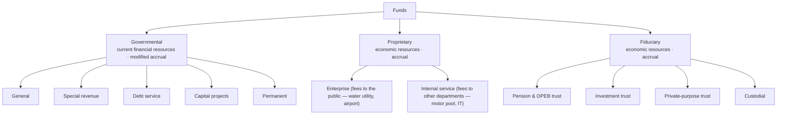

## Two lenses on the same government

| | Government-wide statements | Governmental fund statements |
|---|---|---|
| Statements | Statement of net position; statement of activities | Balance sheet; statement of revenues, expenditures, and changes in fund balances |
| Measurement focus | **Economic resources** | **Current financial resources** |
| Basis | **Full accrual** | **Modified accrual** |
| Capital assets & long-term debt | **Reported** (depreciated) | **Not reported** — capital outlay is an expenditure; debt proceeds are an other financing source |
| Scope | Governmental + business-type activities (not fiduciary) | Each major governmental fund |

Under **modified accrual**, revenues are recognized when **measurable and available** (collectible within the period or soon enough after to pay current liabilities — commonly 60 days for property taxes), and **expenditures** are recognized when the liability is incurred, with exceptions such as debt service recognized when due.

## The fund families



Mnemonic for the governmental funds: "**G**et **S**ome **D**ebt, **C**ity **P**lanners" — **G**eneral, **S**pecial revenue, **D**ebt service, **C**apital projects, **P**ermanent.

> **Permanent fund vs. private-purpose trust:** a permanent fund holds resources whose *earnings* support the government's own programs (e.g., cemetery care); a private-purpose trust benefits individuals or other organizations.

```check
far-gov-chk1
```

## Net position and fund balance

**Government-wide net position** has three components:

1. **Net investment in capital assets** — capital assets, net of depreciation, minus related debt.
2. **Restricted** — externally imposed (creditors, grantors, laws) or by enabling legislation.
3. **Unrestricted** — everything else.

**Governmental fund balance** has five classifications (GASB 54), from most to least constrained:

| Classification | Constraint |
|---|---|
| **Nonspendable** | Not in spendable form (inventory, prepaids) or legally required to be kept intact (permanent fund corpus) |
| **Restricted** | Externally imposed (grantors, creditors, laws of other governments) or by enabling legislation |
| **Committed** | Formal action of the government's highest decision-making body (e.g., council ordinance) |
| **Assigned** | Intended use set by a body or official delegated authority |
| **Unassigned** | Residual — positive only in the general fund |

```worked
title: Converting a governmental fund transaction to the government-wide view
scenario: |
  A town issues $2,000,000 of 10-year bonds at par on July 1 and spends $1,500,000 on a new fire station by
  year-end (December 31). Interest at 4% is payable annually on June 30.
steps:
  - label: Capital projects fund — resources
    work: Bond proceeds are an "other financing source" of 2,000,000; construction is a 1,500,000 capital outlay expenditure.
    result: Fund balance increases 500,000
  - label: Government-wide — assets and liabilities
    work: Capitalize the fire station (1,500,000) and report bonds payable (2,000,000); cash 500,000 remains.
    result: Net position change from these items = 0 (before interest)
  - label: Government-wide — accrued interest at December 31
    work: 2,000,000 × 4% × 6/12
    result: 40,000 interest expense and interest payable (the debt service fund records nothing until due)
insight: The same event reduces the fund balance through expenditures while the government-wide statements simply swap cash for a building — which is why a reconciliation between the two is required.
```

```faded
title: Your turn — modified accrual property tax revenue
scenario: |
  A county levies $5,000,000 of property taxes for its fiscal year ending June 30. By June 30 it collected
  $4,600,000. It expects $250,000 to be collected by August 15 (within 60 days), $100,000 later in the next year,
  and $50,000 to be uncollectible.
steps:
  - label: Property tax revenue in the general fund (modified accrual)
    answer: 4850000
    hint: Measurable and available — collected during the year or within 60 days after.
    solution: 4,600,000 + 250,000 = 4,850,000; the 100,000 collectible later is deferred inflows of resources.
  - label: Property tax revenue in the government-wide statements (accrual)
    answer: 4950000
    solution: Levy 5,000,000 − estimated uncollectible 50,000 = 4,950,000 (for the year the tax was levied).
```

```check
far-gov-chk2
```
