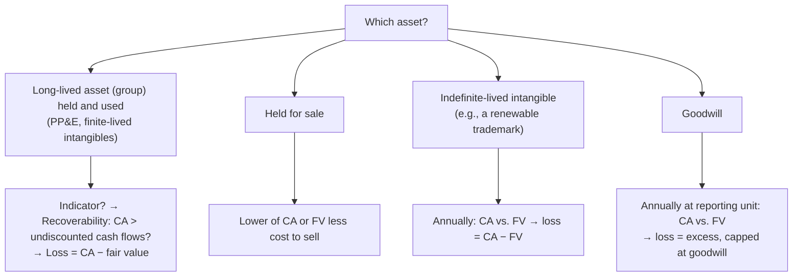

## Which test? Follow the asset.



## Assets held and used — two steps

**Indicators** that trigger testing: a significant drop in market price, adverse change in how the asset is used or in its physical condition, legal or business-climate changes, cost overruns, operating or cash flow losses, or an expectation that the asset will be sold significantly before the end of its life.

```worked
title: Testing a production line
scenario: |
  A production line has a carrying amount of $900,000. Because demand has collapsed, management estimates
  undiscounted future net cash flows of $850,000. The line's fair value is $700,000.
steps:
  - label: Step 1 — recoverability
    work: Carrying amount 900,000 vs. undiscounted cash flows 850,000
    result: 900,000 > 850,000 → not recoverable; go to Step 2
  - label: Step 2 — measure the loss
    work: 900,000 − 700,000 fair value
    result: Impairment loss 200,000 (in income from continuing operations)
  - label: After the write-down
    work: New cost basis 700,000, depreciated over the remaining useful life
    result: No later reversal, even if value recovers
insight: The two numbers do different jobs — undiscounted cash flows decide WHETHER there's an impairment; fair value decides HOW MUCH.
```

> **Trap:** if undiscounted cash flows had been $950,000, there is **no impairment** — even though fair value (700,000) is below carrying amount.

```check
far-imp-chk1
```

## Indefinite-lived intangibles

Test **at least annually** and when events suggest impairment. An optional **qualitative assessment** can skip the quantitative test if it is *not more likely than not* that the asset is impaired. Quantitative test: one step — if carrying amount exceeds fair value, the loss equals the excess.

## Goodwill

For public business entities (ASU 2017-04):

1. Test at the **reporting unit** level, at least annually (and when triggering events occur). An optional qualitative screen is allowed.
2. Compare the reporting unit's **fair value** with its **carrying amount (including goodwill)**.
3. Impairment loss = carrying amount − fair value, **not to exceed the goodwill** allocated to that unit.

```faded
title: Your turn — goodwill impairment
scenario: |
  Reporting unit Beta has net assets with a carrying amount of $5,000,000, including goodwill of $1,200,000.
  Beta's fair value is $4,400,000.
steps:
  - label: Excess of carrying amount over fair value
    answer: 600000
    solution: 5,000,000 − 4,400,000 = 600,000
  - label: Goodwill impairment loss
    answer: 600000
    hint: Compare the excess with the goodwill balance.
    solution: The excess (600,000) is less than goodwill (1,200,000), so the full 600,000 is recognized.
  - label: If Beta's fair value were $3,500,000 instead, the goodwill impairment would be
    answer: 1200000
    solution: Excess = 1,500,000, but the loss is capped at goodwill of 1,200,000.
```

**Private companies** may elect to amortize goodwill (straight-line, generally over 10 years or less) and test it only upon a triggering event, at the entity or reporting-unit level.

## Reversals — the rule of thumb

| Category | Reverse later? |
|---|---|
| Held and used PP&E / finite-lived intangibles | **No** |
| Indefinite-lived intangibles | **No** |
| Goodwill | **No** |
| Held for sale | **Yes**, but only up to cumulative losses previously recognized |

(IFRS permits reversals for assets other than goodwill — a common comparison question.)

```check
far-imp-chk2
```
