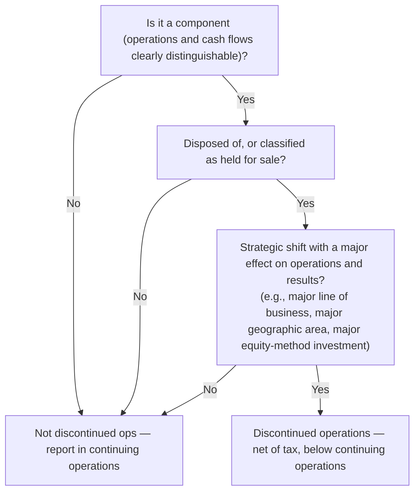

## The shape of a multiple-step income statement

| Line | Example |
|---|---|
| Net sales | 1,000,000 |
| − Cost of goods sold | (600,000) |
| **= Gross profit** | 400,000 |
| − Selling, general & administrative expenses | (250,000) |
| **= Operating income** | 150,000 |
| ± Other income & expense (interest, gains/losses on asset sales, unusual items) | (10,000) |
| **= Income from continuing operations before income taxes** | 140,000 |
| − Income tax expense | (35,000) |
| **= Income from continuing operations** | 105,000 |
| ± Discontinued operations, **net of tax** | (20,000) |
| **= Net income** | 85,000 |

A **single-step** statement groups all revenues and gains, then all expenses and losses — same net income, less detail.

### Unusual or infrequent items

Since 2015 (ASU 2015-01) there is **no "extraordinary item"** category. Events that are unusual in nature *or* infrequent (a plant destroyed by a tornado, a large litigation settlement) are shown as a **separate line within continuing operations**, **before tax**, or disclosed in the notes. They are never shown net of tax.

```check
far-iso-chk1
```

## Discontinued operations

Use the decision tree:



**Held for sale** requires, among other things, management commitment to a plan, availability for immediate sale, an active program to find a buyer, and a sale that is probable within one year. Held-for-sale assets are measured at the **lower of carrying amount or fair value less cost to sell** and are not depreciated.

**What goes in the discontinued-operations line (net of tax):**

1. The component's **results of operations** for the period (income or loss), and
2. The **gain or loss on disposal**, or, if still held for sale, any **impairment write-down** to fair value less cost to sell.

Prior periods presented are **recast** so the component's results appear in discontinued operations for every year shown.

```worked
title: Computing discontinued operations
scenario: |
  In Year 2, Summit Corp. commits to sell its European segment (a strategic shift). At year-end the segment is
  held for sale. The segment's pretax operating loss for Year 2 was $200,000. Its net assets have a carrying
  amount of $900,000 and a fair value less cost to sell of $750,000. The tax rate is 25%.
steps:
  - label: Operating results of the component
    work: Pretax operating loss for the year.
    result: (200,000)
  - label: Impairment to fair value less cost to sell
    work: 750,000 − 900,000
    result: (150,000)
  - label: Total pretax loss from discontinued operations
    work: (200,000) + (150,000)
    result: (350,000)
  - label: Apply the tax benefit
    work: (350,000) × (1 − 0.25)
    result: Loss from discontinued operations, net of tax = (262,500)
insight: Both the operating loss and the write-down live in the same line. The tax effect is netted into that line — it is not part of income tax expense on continuing operations.
```

## Other comprehensive income

Some gains and losses bypass net income and go to **other comprehensive income (OCI)**, accumulating in **AOCI** in equity. The common exam list (mnemonic **"PUFF"**):

- **P**ension and other postretirement items (actuarial gains/losses, prior service cost not yet in pension expense)
- **U**nrealized gains/losses on **available-for-sale debt** securities (the non-credit portion)
- **F**oreign currency translation adjustments
- **F**air value changes in effective cash flow hedges — and the portion of a liability's fair value change due to own credit risk when the fair value option is elected

**Not OCI:** unrealized gains/losses on **equity** securities (go to net income), trading debt securities (net income), and prior-period adjustments (retained earnings).

**Presentation options:** a single continuous statement of comprehensive income, or two consecutive statements (income statement immediately followed by a statement of comprehensive income). OCI items may be shown net of tax, or before tax with a single tax line.

**Reclassification adjustments.** When an AFS security with a previously recorded unrealized gain is sold, the gain is now *realized* in net income. To avoid counting it twice in comprehensive income, it is removed from OCI ("recycled").

```faded
title: Your turn — build the statement
scenario: |
  Crane Co. reports for the year: sales $800,000; cost of goods sold $480,000; selling and administrative expenses
  $170,000; loss from an unusual flood $30,000; interest expense $20,000. Tax rate 25%. Crane also has an
  unrealized gain (net of tax) on AFS debt securities of $12,000 during the year.
steps:
  - label: Gross profit
    answer: 320000
    hint: Sales − COGS
    solution: 800,000 − 480,000 = 320,000
  - label: Operating income
    answer: 150000
    hint: The flood loss and interest are below operating income here.
    solution: 320,000 − 170,000 = 150,000
  - label: Income from continuing operations before taxes
    answer: 100000
    solution: 150,000 − 30,000 − 20,000 = 100,000 (the flood loss stays pretax, in continuing operations)
  - label: Net income
    answer: 75000
    solution: 100,000 × (1 − 0.25) = 75,000 (no discontinued operations)
  - label: Comprehensive income
    answer: 87000
    solution: 75,000 + 12,000 OCI = 87,000
```

```check
far-iso-chk2
```
