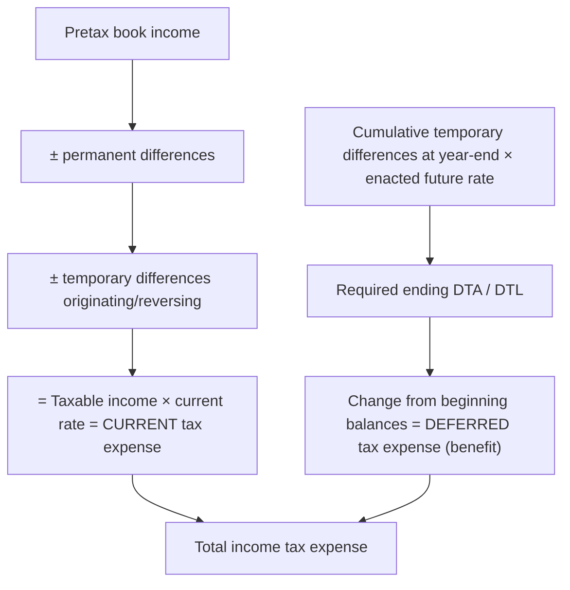

## Temporary or permanent?

| Item | Type | Creates |
|---|---|---|
| Tax depreciation > book depreciation | Temporary | **DTL** (future taxable amounts) |
| Installment sale: book gain now, taxed later | Temporary | **DTL** |
| Equity-method income recognized for books, taxed when dividends received | Temporary | **DTL** |
| Warranty or bad debt expense accrued for books, deducted when paid/written off | Temporary | **DTA** (future deductible amounts) |
| Rent or subscriptions collected in advance (taxed when received) | Temporary | **DTA** |
| NOL carryforward; tax credit carryforwards | — | **DTA** |
| Municipal bond interest; life insurance proceeds on key employees | **Permanent** | none |
| Fines and penalties; nondeductible portion of meals; premiums on key-person life insurance | **Permanent** | none |

> **Memory hook:** ask "Will the tax return show **more** income later (DTL) or **less** income later (DTA)?"

```check
far-tax-chk1
```

## The balance sheet approach



```worked
title: Current and deferred tax expense
scenario: |
  Pretax book income $800,000. Permanent differences: municipal bond interest $20,000; fines $10,000.
  Temporary differences arising this year: tax depreciation exceeds book by $60,000; warranty expense accrued
  but not yet deductible $30,000. No beginning deferred balances. Enacted rate 21% for all years.
steps:
  - label: Taxable income
    work: 800,000 − 20,000 + 10,000 − 60,000 + 30,000
    result: 760,000
  - label: Current tax expense (taxes payable)
    work: 760,000 × 21%
    result: 159,600
  - label: Deferred balances
    work: DTL 60,000 × 21% = 12,600; DTA 30,000 × 21% = 6,300
    result: Net DTL 6,300 → deferred tax expense 6,300
  - label: Total income tax expense
    work: 159,600 + 6,300
    result: 165,900 (effective rate 20.7% — below 21% because of the permanent differences)
insight: Temporary differences shift tax between periods but don't change total tax expense's relationship to book income; permanent differences are what move the effective rate.
```

```je
title: Recording the tax provision
lines:
  - { account: Income tax expense — current, debit: 159600 }
  - { account: Income tax expense — deferred, debit: 6300 }
  - { account: Deferred tax asset, debit: 6300 }
  - { account: Income taxes payable, credit: 159600 }
  - { account: Deferred tax liability, credit: 12600 }
```

## Rates, allowances, and uncertainty

**Enacted rates only.** Use the rate enacted for the years the differences reverse. When a new rate is **enacted**, remeasure all DTAs and DTLs immediately; the entire effect goes to income tax expense from continuing operations in the enactment period (even for items originally recorded in OCI).

**Valuation allowance.** If it is **more likely than not** (> 50%) that some portion of a DTA will not be realized, reduce it with an allowance. Evidence: future reversals of existing DTLs, projected taxable income, carryback availability, tax-planning strategies; negative evidence includes cumulative recent losses.

**NOLs (federal, for losses arising after 2017):** carried forward **indefinitely**, but the deduction is limited to **80% of taxable income**; generally no carryback. The carryforward creates a DTA (subject to a valuation allowance assessment).

**Uncertain tax positions (two steps):**
1. **Recognition** — is it **more likely than not** the position will be sustained on examination, based on technical merits (assume the taxing authority knows all facts)?
2. **Measurement** — recognize the **largest amount** that is **more than 50% likely** to be realized on settlement. The unrecognized portion is a liability for unrecognized tax benefits.

```faded
title: Your turn — a DTL with a future rate change
scenario: |
  At the end of Year 1, a company has a $400,000 cumulative excess of tax over book depreciation that will reverse
  in Year 3 and later. The current rate is 21%, but in December of Year 1 a law was enacted raising the rate to
  25% starting in Year 3. The DTL at the start of Year 1 was $42,000 (on $200,000 of differences at 21%).
steps:
  - label: Required DTL at the end of Year 1
    answer: 100000
    hint: Use the enacted rate for the reversal years.
    solution: 400,000 × 25% = 100,000
  - label: Deferred tax expense for Year 1
    answer: 58000
    solution: 100,000 − 42,000 = 58,000 (includes the effect of the rate change on the beginning balance)
```

## Presentation and disclosure

- All deferred tax assets and liabilities are **noncurrent**, netted by tax-paying component and jurisdiction.
- **Intraperiod allocation**: tax follows the item — continuing operations, discontinued operations, OCI, and prior-period adjustments each carry their own tax effect.
- Disclose the components of tax expense, significant DTAs/DTLs, valuation allowance changes, and a **rate reconciliation** (expanded for public entities by ASU 2023-09).

```check
far-tax-chk2
```
