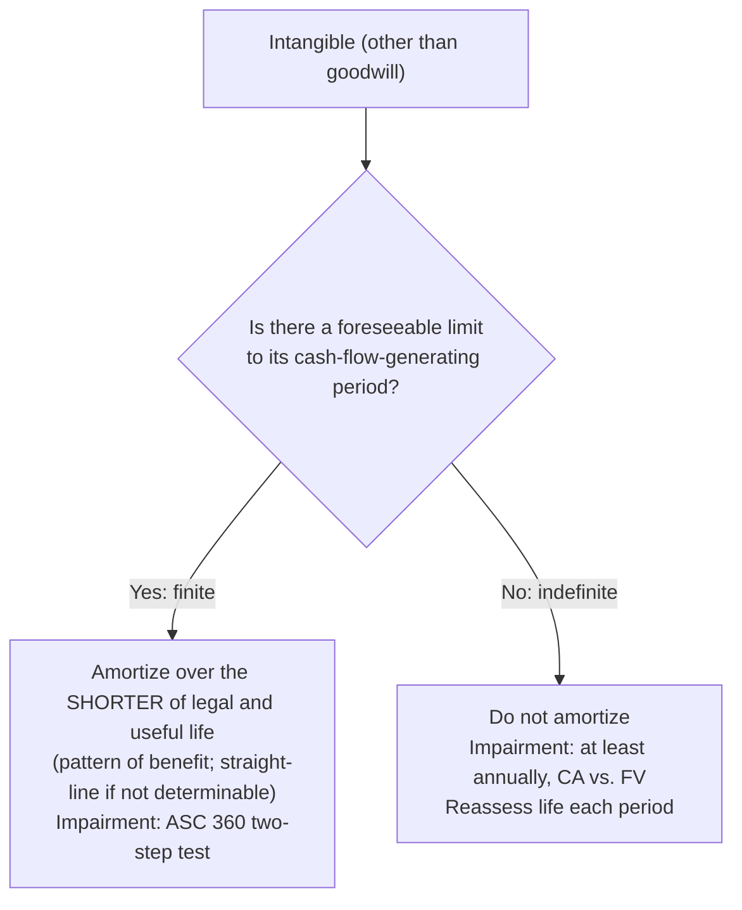

## Getting intangibles on the books

| How obtained | Accounting |
|---|---|
| **Purchased separately** | Capitalize the cost (price plus direct costs) |
| **Acquired in a business combination** | Recognize identifiable intangibles (those arising from **contractual/legal rights** or that are **separable**) at fair value, separate from goodwill |
| **Developed internally** | Expense research, development, advertising, training, and the like. Capitalize only direct costs such as **legal and registration fees** for a patent or trademark |

> Detailed R&D and internal-use software accounting is tested in BAR; for FAR, remember that internal development costs are expensed.

## Finite vs. indefinite lives



| Asset | Typical treatment |
|---|---|
| Patent | Finite: legal life 20 years from filing — often a shorter useful life |
| Copyright | Finite: author's life + 70 years, usually far shorter useful life |
| Customer list | Finite |
| Trademark / trade name (renewable at little cost, intended to renew) | **Indefinite** |
| Broadcast license renewable without substantial cost | Often indefinite |
| Franchise with a fixed term | Finite (over the term) |

If an indefinite life later becomes finite, start amortizing (after testing for impairment).

```worked
title: Patent amortization with a legal defense
scenario: |
  On January 1, Year 1, a company buys a patent for $180,000. Its remaining legal life is 15 years; the company
  expects it to be useful for 12 years. On January 1, Year 3, the company successfully defends the patent,
  paying $24,000 in legal fees. The remaining useful life is unchanged.
steps:
  - label: Annual amortization, Years 1–2
    work: 180,000 ÷ 12 (shorter of legal and useful life)
    result: 15,000 per year; carrying amount 150,000 at January 1, Year 3
  - label: Capitalize the successful defense
    work: 150,000 + 24,000
    result: 174,000
  - label: Year 3 amortization
    work: 174,000 ÷ 10 remaining years
    result: 17,400
insight: Had the defense failed, the 24,000 would be expensed — and the patent itself likely written off, since it no longer protects anything.
```

```check
far-int-chk1
```

## Goodwill

Goodwill appears **only in a business combination**, as a residual:

> Goodwill = consideration transferred + fair value of noncontrolling interest (if any) − fair value of identifiable net assets acquired

If the result is negative, it is a **bargain purchase gain** (after re-checking the measurements). Goodwill is not amortized by public companies; it's tested for impairment (see the impairment module).

```faded
title: Your turn — measuring goodwill
scenario: |
  A company pays $2,500,000 cash to acquire 100% of another company. The target's identifiable assets have a
  fair value of $3,100,000 (including a customer list valued at $200,000 that the target never recorded) and
  its liabilities have a fair value of $900,000.
steps:
  - label: Fair value of identifiable net assets
    answer: 2200000
    solution: 3,100,000 − 900,000 = 2,200,000 (the customer list is identifiable and included)
  - label: Goodwill
    answer: 300000
    solution: 2,500,000 − 2,200,000 = 300,000
  - label: Goodwill if the price had been $2,000,000 (bargain purchase gain entered as a negative)
    answer: -200000
    solution: 2,000,000 − 2,200,000 = −200,000 → no goodwill; a 200,000 bargain purchase gain in earnings
```

## Costs that are always expensed

Start-up costs (opening a new facility, entering a new market), organization costs (legal fees to incorporate), relocation, internally generated goodwill, and most advertising.

```check
far-int-chk2
```
