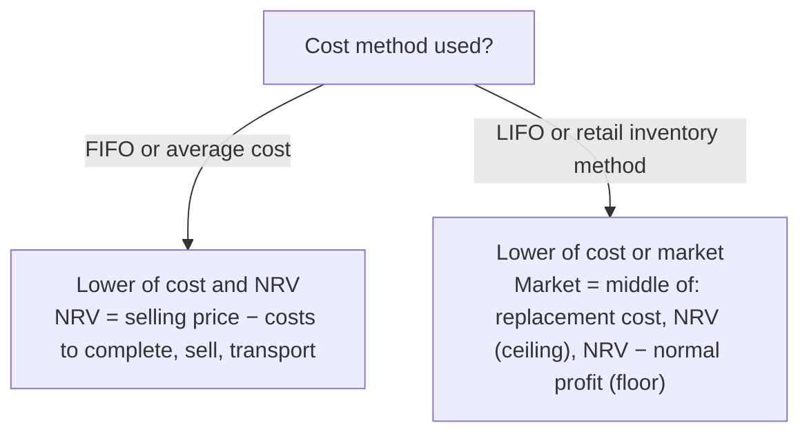

## Which test applies?



```worked
title: Lower of cost or market (a LIFO company)
scenario: |
  An item costs $50. Selling price $60; costs to sell $8; normal profit margin $12 per unit.
  Consider three possible replacement costs: $42, $55, and $35.
steps:
  - label: Ceiling and floor
    work: NRV (ceiling) = 60 − 8 = 52; floor = 52 − 12 = 40
    result: Market must fall between 40 and 52
  - label: Replacement cost 42
    work: Middle of (42, 52, 40) = 42; compare to cost 50
    result: LCM = 42 (write down 8)
  - label: Replacement cost 55
    work: Middle of (55, 52, 40) = 52; compare to cost 50
    result: LCM = 50 (no write-down)
  - label: Replacement cost 35
    work: Middle of (35, 52, 40) = 40; compare to cost 50
    result: LCM = 40 (write down 10)
insight: For a FIFO company, only NRV matters — the answer would be the lower of 50 and 52 = 50 in every case.
```

LCNRV/LCM can be applied item by item, by category, or to total inventory — **item by item** gives the lowest (most conservative) result.

```check
far-iv-chk1
```

## Estimating inventory

### Gross profit method

Used for interim statements and to estimate losses from fire or theft — **not** acceptable for annual GAAP statements.

> Ending inventory = beginning inventory + purchases − **estimated COGS**, where estimated COGS = sales × (1 − gross profit % on sales).

**Watch the base.** If told "markup on cost is 25%," convert: GP% on sales = 0.25 ÷ 1.25 = **20%**.

```faded
title: Your turn — fire loss
scenario: |
  A warehouse burned on May 31. Beginning inventory $80,000; purchases through May 31 $520,000; sales through
  May 31 $700,000. The company's gross profit rate is 30% of sales. Salvaged inventory is worth $15,000.
steps:
  - label: Estimated cost of goods sold
    answer: 490000
    solution: 700,000 × (1 − 0.30) = 490,000
  - label: Estimated inventory on May 31
    answer: 110000
    solution: 80,000 + 520,000 − 490,000 = 110,000
  - label: Estimated fire loss
    answer: 95000
    solution: 110,000 − 15,000 salvage = 95,000
```

### Retail inventory method

Retailers track goods at **retail** prices and convert to cost with a cost-to-retail ratio.

| | Cost | Retail |
|---|---|---|
| Beginning inventory | 40,000 | 60,000 |
| Purchases | 260,000 | 380,000 |
| Net markups | | 20,000 |
| **Goods available (for the LCM ratio)** | **300,000** | **460,000** |
| Net markdowns | | (10,000) |
| Sales | | (350,000) |
| **Ending inventory at retail** | | **100,000** |

- **Conventional (LCM) retail**: ratio **excludes** markdowns → 300,000 ÷ 460,000 = 65.2%; ending ≈ **65,217**.
- **Average-cost retail**: ratio **includes** markdowns → 300,000 ÷ 450,000 = 66.7%; ending ≈ **66,667**.

Excluding markdowns makes the ratio smaller and the inventory lower — that's how the conventional method approximates LCM.

## Inventory errors

Ending inventory this year is beginning inventory next year, so errors **counterbalance**:

| Error | Year 1 COGS | Year 1 net income | Year 2 net income | Retained earnings end of Year 2 |
|---|---|---|---|---|
| Year 1 ending inventory **understated** | Overstated | **Understated** | **Overstated** | Correct |
| Year 1 ending inventory **overstated** | Understated | **Overstated** | **Understated** | Correct |

```check
far-iv-chk2
```

## Inventory roll-forwards and perpetual-record reconciliations

**Roll-forward:** beginning inventory + purchases + freight-in − purchase returns and discounts − cost of goods sold = book inventory. Compare book inventory with the **physical count** at cost. The difference is shrinkage, usually charged to cost of goods sold.

| Check | Why it matters |
|---|---|
| Freight-in included | It is a cost of the inventory (ASC 330), not a selling expense |
| Returns and discounts deducted | They reduce cost |
| Book vs. count difference is plausible | An unexplained *overage* usually means an error in the roll-forward, not found goods |

**Reconciling the perpetual subledger to the GL.** Ownership, not location, decides what belongs in inventory:

- **FOB shipping point, in transit at year-end**: the buyer owns it, so include it even though it is not on the dock.
- **FOB destination, in transit**: still the seller's inventory.
- **Consigned-in goods** (held for someone else): exclude them. **Consigned-out goods** (at a consignee): include them.
- **Duplicate receiving entries**: remove them.

Adjust the record that is wrong, then confirm that the adjusted subledger equals the general ledger.
