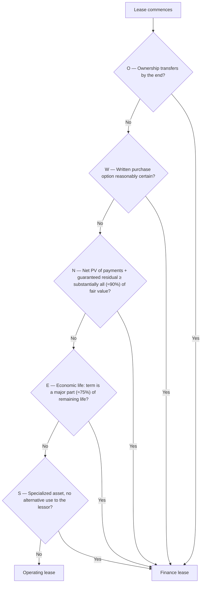

## Is there a lease?

A contract contains a lease if the customer has the **right to control the use of an identified asset** for a period of time: it gets substantially all the economic benefits from use **and** directs how and for what purpose the asset is used. If the supplier can substitute the asset at will (substantive substitution rights), there's no identified asset — it's a service.

## Finance or operating? The OWNES test



(The 90% and 75% thresholds are reasonable bright lines many companies use; the standard says "substantially all" and "major part." The economic-life test doesn't apply if the lease starts at or near the end of the asset's life.)

```check
far-lsf-chk1
```

## Measuring at commencement

**Lease payments** included: fixed payments (less incentives receivable), variable payments that depend on an **index or rate** (at the commencement index), the exercise price of a purchase option **reasonably certain** to be exercised, termination penalties if the term reflects termination, and amounts **probable** of being owed under **residual value guarantees**. Usage- or performance-based variable payments are excluded (expensed as incurred).

**Discount rate:** the rate implicit in the lease if readily determinable; otherwise the lessee's **incremental borrowing rate** (private companies may elect a risk-free rate).

```worked
title: Finance lease — first year
scenario: |
  On January 1, a company leases equipment for 5 years (its entire economic life). Payments of $50,000 are due
  each January 1, starting at commencement. The incremental borrowing rate is 6% (implicit rate unknown).
steps:
  - label: Lease liability and ROU asset at commencement
    work: 50,000 × PV of annuity due (6%, 5) = 50,000 × 4.46511
    result: 223,255 — finance lease (term = 100% of economic life)
  - label: First payment on January 1
    work: Entire payment reduces principal (no interest has accrued yet)
    result: Liability = 173,255
  - label: December 31 interest
    work: 173,255 × 6%
    result: 10,395 interest expense (accrued)
  - label: December 31 ROU amortization
    work: 223,255 ÷ 5 (straight-line; shorter of lease term and useful life)
    result: 44,651
  - label: Total Year 1 expense
    work: 10,395 + 44,651
    result: 55,046 — more than the 50,000 cash paid; finance-lease expense is front-loaded
```

```je
title: Commencement (January 1)
lines:
  - { account: Right-of-use asset, debit: 223255 }
  - { account: Lease liability, credit: 173255 }
  - { account: Cash, credit: 50000 }
memo: Equivalent to recording the full 223,255 liability and then the first payment.
```

## Amortization period

The ROU asset is amortized over the **shorter of the lease term or useful life** — unless ownership transfers or a purchase option is reasonably certain, in which case use the asset's **useful life**.

```faded
title: Your turn — finance lease with payments in arrears
scenario: |
  A 4-year lease requires $30,000 payments at the END of each year. The lessee's incremental borrowing rate is
  8% (PV of an ordinary annuity, 8%, 4 periods = 3.31213). The lease transfers ownership at the end.
  The equipment's useful life is 6 years.
steps:
  - label: Initial lease liability
    answer: 99364
    tolerance: 2
    solution: 30,000 × 3.31213 = 99,364
  - label: Year 1 interest expense
    answer: 7949
    tolerance: 2
    solution: 99,364 × 8% = 7,949
  - label: Year 1 ROU amortization
    answer: 16561
    tolerance: 2
    hint: Ownership transfers — use the useful life, not the lease term.
    solution: 99,364 ÷ 6 = 16,561
  - label: Lease liability at the end of Year 1
    answer: 77313
    tolerance: 2
    solution: 99,364 + 7,949 − 30,000 = 77,313
```

## Presentation (finance leases)

- ROU assets and lease liabilities from finance leases are presented separately from operating leases (or disclosed).
- Income statement: **interest expense** and **amortization expense** (separate lines).
- Cash flows: principal portion → **financing**; interest portion → **operating**.

```check
far-lsf-chk2
```
