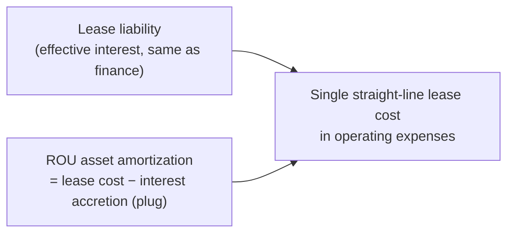
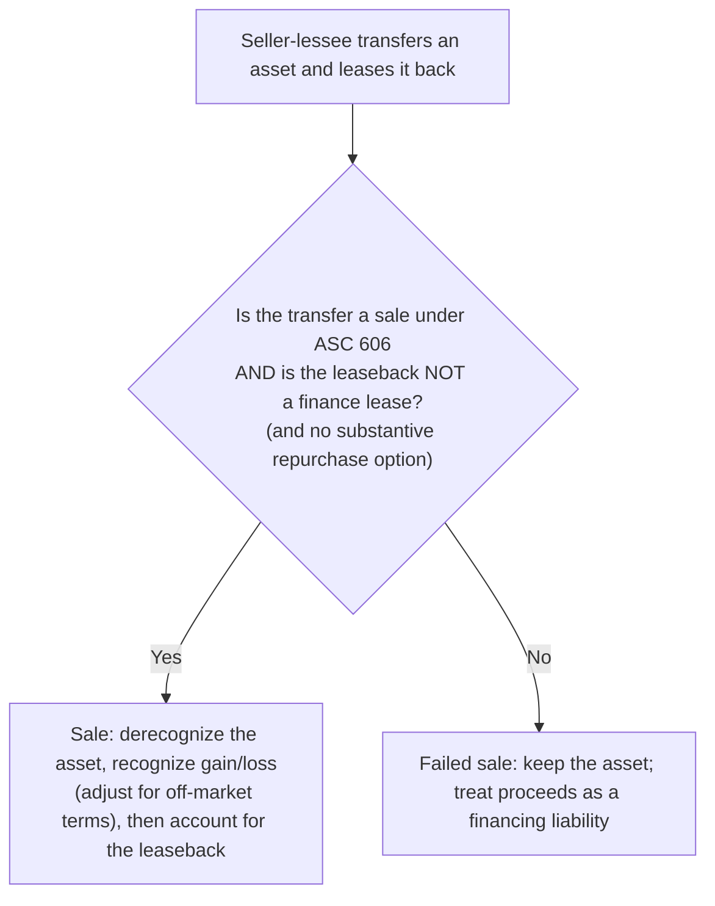

## Operating lease mechanics



Using the same facts as the finance lease example in Leases I (5 payments of $50,000 each January 1, 6%, liability and ROU asset $223,255) but assuming the equipment's life is 10 years (so it's an **operating** lease):

| Year 1 | Operating lease | Finance lease |
|---|---|---|
| Expense on the income statement | **50,000** single lease cost | 10,395 interest + 44,651 amortization = **55,046** |
| Liability at Dec 31 | 173,255 + 10,395 = **183,650** | 183,650 |
| ROU asset at Dec 31 | 223,255 − (50,000 − 10,395) = **183,650** | 223,255 − 44,651 = **178,604** |

Same liability either way; the difference is how the asset is amortized and how the expense is labeled.

```check
far-lso-chk1
```

## Uneven payments

When payments escalate, the **lease cost is still straight-line**; the difference between cash and cost accumulates as accrued rent, which is why the ROU asset and liability diverge.

```worked
title: Escalating payments
scenario: |
  A 3-year operating lease has payments of $90,000, $100,000, and $110,000 at the END of Years 1–3. The discount
  rate is 5%. There are no initial direct costs or incentives.
steps:
  - label: Initial liability and ROU asset
    work: 90,000/1.05 + 100,000/1.05² + 110,000/1.05³
    result: 271,439
  - label: Straight-line lease cost
    work: (90,000 + 100,000 + 110,000) ÷ 3
    result: 100,000 per year
  - label: Year 1 liability
    work: 271,439 + interest 13,572 − payment 90,000
    result: 195,011
  - label: Year 1 ROU amortization and ending ROU asset
    work: 100,000 lease cost − 13,572 interest = 86,428; 271,439 − 86,428
    result: ROU asset 185,011
insight: The liability exceeds the ROU asset by 10,000 — the straight-line cost (100,000) exceeded the cash paid (90,000), creating accrued rent embedded in the ROU asset.
```

## Sale-leaseback (seller-lessee)



```faded
title: Your turn — a qualifying sale-leaseback
scenario: |
  A company sells its headquarters (carrying amount $800,000) to an investor for $1,000,000, which equals fair
  value, and leases it back for 5 years under an operating lease. The PV of the leaseback payments is $300,000
  (discount rate appropriate, at-market rent).
steps:
  - label: Gain on sale recognized immediately
    answer: 200000
    solution: 1,000,000 − 800,000 = 200,000 (at fair value, at-market terms → no adjustment)
  - label: ROU asset and lease liability recognized for the leaseback
    answer: 300000
    solution: Both measured at the PV of leaseback payments, 300,000
```

If the sale price is **below** fair value, the shortfall is treated as a **prepayment of rent** (increases the ROU asset); if **above** fair value, the excess is **additional financing** from the buyer.

## Presentation summary

| | Operating lease | Finance lease |
|---|---|---|
| Balance sheet | ROU asset & lease liability (separate from finance leases or disclosed) | Same |
| Income statement | Single straight-line lease cost (operating) | Interest expense + amortization |
| Cash flows | Payments → **operating** | Principal → **financing**; interest → **operating** |
| Disclosures | Weighted-average remaining term and discount rate, maturity analysis of undiscounted payments, lease cost components | Same |

```check
far-lso-chk2
```
