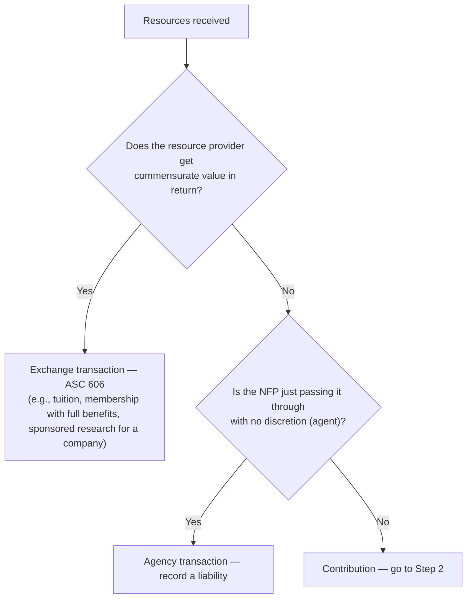

## Step 1: Is it a contribution at all?



Membership dues are often **part exchange, part contribution**: if a $250 membership provides benefits worth $60, the $190 excess is a contribution.

## Step 2: Conditional or unconditional?

Since ASU 2018-08, a promise is **conditional only if it has both**:

1. A **barrier** the NFP must overcome (a measurable performance hurdle, a matching requirement, limited discretion over how to conduct an activity), **and**
2. A **right of return** of assets transferred or a **right of release** from the promise.

| Scenario | Classification |
|---|---|
| "$100,000 if you raise $100,000 from other donors by Dec 31" | **Conditional** (matching barrier + implied release) |
| "$100,000 for scholarships next year" | Unconditional, **with donor restriction** (purpose/time) |
| Oral pledge with no evidence | Not recognized — promises must be verifiable |

> **Restrictions ≠ conditions.** A restriction limits *how* the NFP uses a gift it has already earned; a condition determines *whether* the NFP gets it.

```check
far-nfr-chk1
```

## Step 3: Measurement and timing

- **Unconditional promises to give**: recognize when received (verifiable), at fair value. Pledges due in future years are measured at **present value**; later accretion of the discount is **contribution revenue** (not interest income). Record an allowance for uncollectible pledges.
- Pledges payable in future periods carry an **implied time restriction** — net assets with donor restrictions until the cash is due — unless the donor explicitly says the gift supports current activities.
- **Conditional promises**: not recognized until conditions are **substantially met**. Cash received before that is a **refundable advance** (liability).

```worked
title: A multi-year pledge
scenario: |
  On December 31, Year 1, a donor makes an unconditional pledge of $100,000 payable on December 31, Year 2
  and $100,000 on December 31, Year 3. The appropriate discount rate is 5%.
steps:
  - label: Present value of the Year 2 payment
    work: 100,000 ÷ 1.05
    result: 95,238
  - label: Present value of the Year 3 payment
    work: 100,000 ÷ 1.05²
    result: 90,703
  - label: Contribution revenue in Year 1
    work: 95,238 + 90,703
    result: 185,941 — net assets with donor restrictions (time)
  - label: Year 2 discount accretion
    work: 185,941 × 5%
    result: About 9,297, reported as contribution revenue
```

## Special kinds of contributions

**Contributed services** are recognized (at fair value, as revenue and expense or asset) **only if** they:

- **create or enhance nonfinancial assets** (e.g., volunteers building a shed), **or**
- require **specialized skills**, are provided by individuals **possessing** those skills, and would typically need to be **purchased** if not donated (e.g., a CPA auditing the books, a doctor treating patients).

General volunteers (serving meals, answering phones) are **not** recognized — but may be disclosed.

**Donated materials, facilities, and use of assets**: recognized at fair value. Contributed nonfinancial assets are presented as a separate line item and disaggregated in the notes (ASU 2020-07).

**Collections** (art, historical treasures) may be left off the balance sheet if all three are met: held for public exhibition, education, or research; protected and preserved; and proceeds from sales are used to acquire other collection items or for their direct care.

```faded
title: Your turn — what gets recognized?
scenario: |
  During the year a youth center received: (1) $40,000 cash from a donor restricted to summer camp next year;
  (2) a pledge of $25,000 conditioned on the center raising $25,000 from others — the center has raised $10,000;
  (3) 500 hours of volunteer tutoring by college students (no special skills required), fair value $7,500;
  (4) free legal services from an attorney drafting leases the center would otherwise have paid for, fair value
  $6,000; (5) $3,000 of donated sports equipment.
steps:
  - label: Total contribution revenue recognized
    answer: 49000
    hint: The conditional pledge waits; general volunteers are not recognized.
    solution: 40,000 + 6,000 + 3,000 = 49,000
  - label: Of that, the amount reported as with donor restrictions
    answer: 40000
    solution: Only the camp gift carries a donor restriction (purpose/time).
```

```check
far-nfr-chk2
```
