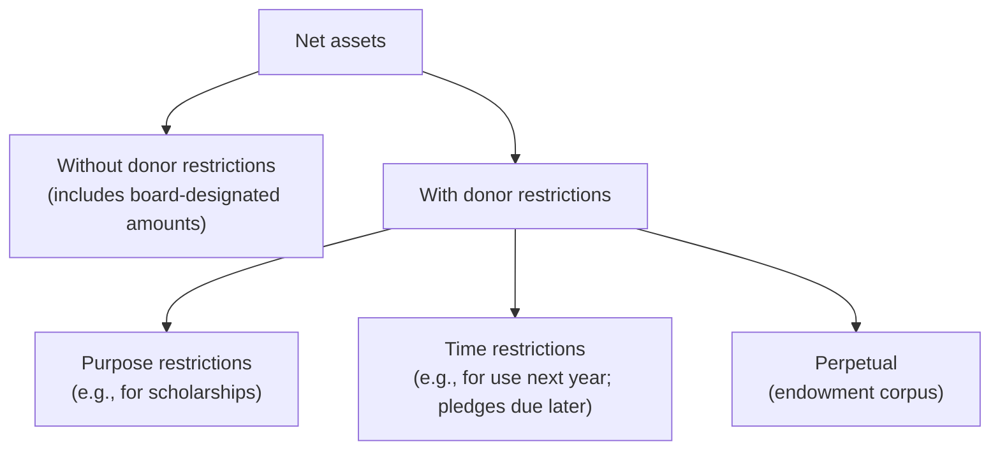

## The four NFP statements

| Business | Not-for-profit (ASC 958) |
|---|---|
| Balance sheet | **Statement of financial position** |
| Income statement | **Statement of activities** (change in net assets) |
| Statement of cash flows | **Statement of cash flows** (direct or indirect; no reconciliation required if direct) |
| — | **Analysis of expenses by function and nature** (separate statement, on the face of the statement of activities, or in the notes) |

## Two classes of net assets



> **Trap:** A **board** designation (e.g., "board-designated endowment") is an internal decision the board can reverse — the net assets remain **without donor restrictions**.

## Releases from restriction

When the donor's purpose is fulfilled or the time passes, the NFP reclassifies the amount:

```je
title: Restricted gift spent for its purpose
lines:
  - { account: Net assets with donor restrictions — reclassification out, debit: 200000 }
  - { account: Net assets without donor restrictions — reclassification in, credit: 200000 }
memo: The expense itself (or the asset purchase) is recorded in net assets without donor restrictions. On the statement of activities this shows as "net assets released from restrictions."
```

**Expenses are always reported as decreases in net assets without donor restrictions.** Restricted resources "flow through" unrestricted net assets when spent.

A gift of cash restricted to buy a long-lived asset is released when the asset is **placed in service** (absent other donor stipulations).

```check
far-nfs-chk1
```

## The statement of activities

```worked
title: Change in net assets by class
scenario: |
  Hope Shelter's year: unrestricted contributions 500,000; contributions restricted for a youth program 150,000;
  youth program expenses paid from restricted gifts 90,000; other program expenses 380,000;
  management and general 70,000; fundraising 40,000.
steps:
  - label: Without donor restrictions — revenues and releases
    work: 500,000 contributions + 90,000 released from restriction
    result: 590,000
  - label: Without donor restrictions — expenses
    work: Program (90,000 + 380,000) + M&G 70,000 + fundraising 40,000
    result: 580,000
  - label: Change in net assets without donor restrictions
    work: 590,000 − 580,000
    result: +10,000
  - label: Change in net assets with donor restrictions
    work: 150,000 contributions − 90,000 released
    result: +60,000
  - label: Total change in net assets
    work: 10,000 + 60,000
    result: +70,000
insight: The 90,000 youth-program spending appears twice — as a release into unrestricted net assets and as a program expense there — so its net effect on unrestricted net assets is zero.
```

## Classifying expenses

- **Program services** — activities that fulfill the mission (e.g., meals served, shelter beds).
- **Supporting activities** — **management and general** (governance, accounting, HR) and **fundraising** (campaigns, special events costs directly benefiting donors are handled separately).
- Costs shared by programs and support (e.g., the building) are **allocated**; joint costs of activities with fundraising and program elements are allocated only if purpose, audience, and content criteria are met.

All NFPs must present an **analysis of expenses by both function and natural classification** (salaries, rent, depreciation, etc.).

## Liquidity disclosures

NFPs disclose **qualitative** information about how they manage liquid resources and **quantitative** information about the availability of financial assets at the balance sheet date to meet cash needs for general expenditures **within one year**.

```faded
title: Your turn — net assets at year-end
scenario: |
  At January 1, a museum had net assets without donor restrictions of $2,400,000 and with donor restrictions of
  $1,100,000. During the year: unrestricted revenues $1,800,000; restricted gifts $300,000; releases from
  restriction $250,000; total expenses $1,950,000.
steps:
  - label: Ending net assets without donor restrictions
    answer: 2500000
    hint: Beginning + unrestricted revenues + releases − expenses
    solution: 2,400,000 + 1,800,000 + 250,000 − 1,950,000 = 2,500,000
  - label: Ending net assets with donor restrictions
    answer: 1150000
    solution: 1,100,000 + 300,000 − 250,000 = 1,150,000
  - label: Total net assets at year-end
    answer: 3650000
    solution: 2,500,000 + 1,150,000 = 3,650,000
```

```check
far-nfs-chk2
```
