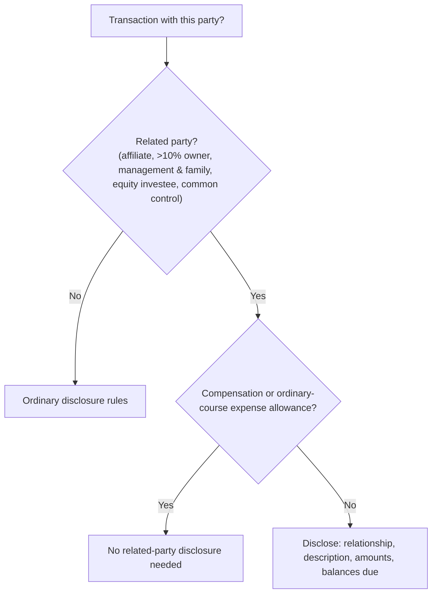

## Note 1: significant accounting policies

The first note usually summarizes **the accounting principles and methods of applying them** that materially affect the statements — especially where GAAP offers choices or the entity's policy is unusual or industry-specific.

| Typically in the policies note | Not in the policies note |
|---|---|
| Basis of consolidation | Composition of inventory (raw materials vs. finished goods) |
| Inventory cost method (FIFO, weighted average) | Details of a debt issue, maturities |
| Depreciation methods | Dollar amounts of depreciation expense |
| Revenue recognition policies | Specific litigation |
| Definition of cash equivalents | |

The pattern: the policies note says **how**, other notes say **how much**.

```check
far-nd-chk1
```

## Related parties

**Who is a related party?** Affiliates, entities under common control, equity-method investees, principal owners (more than 10% of voting interests), management and their immediate families, trusts for employee benefits managed by management, and any party that can significantly influence the other.

**Disclose** (ASC 850-10-50):

1. The **nature of the relationship**,
2. A **description of the transactions** (including those with nominal or no amounts) for each period presented,
3. The **dollar amounts** of transactions and the effects of any change in terms, and
4. **Amounts due to or from** related parties at the balance sheet date.

**Excluded:** compensation arrangements, expense allowances, and other similar items in the ordinary course of business — and transactions eliminated in consolidation (in the consolidated statements).

> **Trap:** A company may **not** state that a related-party transaction was on terms equivalent to an arm's-length transaction unless it can **substantiate** that claim.



## Risks and uncertainties (ASC 275)

Four disclosure areas:

1. **Nature of operations** — major products/services and principal markets.
2. **Use of estimates** — a statement that preparing statements under GAAP requires estimates.
3. **Certain significant estimates** — disclose when it is **at least reasonably possible** that an estimate will **change in the near term** (within one year of the statement date) and the effect would be **material**.
4. **Current vulnerability due to concentrations** — concentrations in customers, suppliers, lenders, products, markets, or geographic areas, disclosed when the concentration exists at the statement date, makes the entity vulnerable to a **near-term severe impact**, and that impact is at least reasonably possible.

Special rule: **all** concentrations of labor subject to collective bargaining agreements, and operations located outside the entity's home country, are candidates; for labor, disclose the percentage covered and whether agreements expire within one year when the vulnerability test is met.

```check
far-nd-chk2
```
