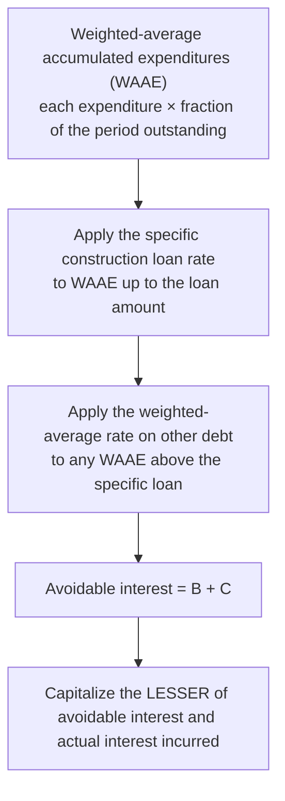

## What goes into the cost?

| Asset | Capitalize | Expense |
|---|---|---|
| **Land** | Purchase price, broker and legal fees, title insurance, survey, clearing and grading, demolition of an old building (less salvage), back taxes assumed, permanent improvements maintained by the city (streets, sewers assessed to owner) | Annual property taxes after purchase |
| **Land improvements** (depreciable) | Parking lots, driveways, fences, landscaping with limited life, outdoor lighting | |
| **Building** | Purchase price or construction cost, architect fees, building permits, excavation for the foundation, capitalized interest during construction | Costs of a strike, uninsured accidents during construction |
| **Equipment** | Price (net of discounts), sales tax, freight, insurance in transit, installation, testing and trial runs | Repairs after the asset is in use; training staff to operate it |

> **Trap:** Demolishing an old building on land just purchased → **land** cost (it prepares the land). Demolishing a building the company already used → loss on disposal of that building.

```check
far-ppe-chk1
```

## Lump-sum (basket) purchases

When several assets are bought for one price, allocate by **relative fair values**:

| Asset | Fair value | % of total | Allocated cost of $900,000 |
|---|---|---|---|
| Land | 300,000 | 30% | 270,000 |
| Building | 600,000 | 60% | 540,000 |
| Equipment | 100,000 | 10% | 90,000 |
| **Total** | **1,000,000** | 100% | **900,000** |

## Asset retirement obligations (brief)

If the company is legally obligated to dismantle an asset or restore a site, it records the **fair value of the ARO** (usually a present value) as a liability and **adds the same amount to the asset's cost**. The liability accretes (interest-like expense) and the added cost is depreciated.

## Capitalizing interest on self-constructed assets

**Qualifying assets:** assets constructed for the company's own use, or discrete projects (e.g., ships, real estate developments) built for sale or lease. **Not qualifying:** inventory routinely produced in large quantities, assets already in use or ready for use, and land not being developed.

The steps:



```worked
title: Capitalized interest on a new warehouse
scenario: |
  A company builds a warehouse during the year: expenditures of $600,000 on January 1, $400,000 on July 1, and
  $200,000 on October 1. The warehouse is completed December 31. Debt outstanding all year: an 8% $500,000
  construction loan and $2,000,000 of 10% general bonds.
steps:
  - label: Weighted-average accumulated expenditures
    work: 600,000 × 12/12 + 400,000 × 6/12 + 200,000 × 3/12 = 600,000 + 200,000 + 50,000
    result: 850,000
  - label: Interest on the specific loan
    work: 500,000 × 8%
    result: 40,000
  - label: Interest on the excess using the general rate
    work: (850,000 − 500,000) × 10%
    result: 35,000
  - label: Avoidable interest vs. actual interest
    work: "Avoidable 75,000; actual = 500,000 × 8% + 2,000,000 × 10% = 240,000"
    result: Capitalize 75,000; expense the remaining 165,000
insight: Interest capitalized becomes part of the warehouse's cost and is depreciated over its life.
```

```faded
title: Your turn — capitalized interest
scenario: |
  A company starts building its own headquarters on April 1 and spends $1,200,000 that day, then $800,000 on
  October 1. Construction continues into next year. It has no specific construction loan; its only debt is
  $3,000,000 of 9% notes outstanding all year. Calendar year-end.
steps:
  - label: Weighted-average accumulated expenditures for the year
    answer: 1100000
    hint: April 1 spending is outstanding 9 months; October 1 spending 3 months.
    solution: 1,200,000 × 9/12 + 800,000 × 3/12 = 900,000 + 200,000 = 1,100,000
  - label: Avoidable interest
    answer: 99000
    solution: 1,100,000 × 9% = 99,000
  - label: Actual interest incurred
    answer: 270000
    solution: 3,000,000 × 9% = 270,000
  - label: Interest capitalized
    answer: 99000
    solution: Lesser of 99,000 and 270,000 = 99,000
```

## After the asset is in service

| Expenditure | Treatment |
|---|---|
| **Addition** (a new wing) | Capitalize |
| **Improvement/betterment** (replace a roof with a better one; upgrade that increases capacity or life) | Capitalize (remove the old component's cost if known) |
| **Extraordinary repair** that extends useful life | Capitalize |
| **Ordinary repairs and maintenance** | Expense |

```check
far-ppe-chk2
```
