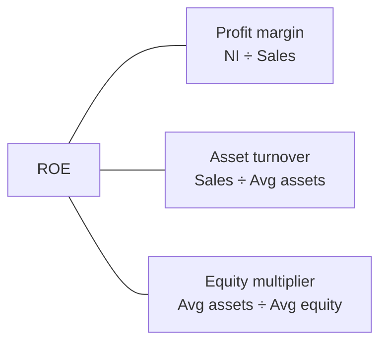

## The four families

| Family | Question | Key ratios |
|---|---|---|
| **Liquidity** | Can it pay near-term bills? | Current ratio, quick (acid-test) ratio |
| **Activity** | How efficiently are assets used? | Receivable turnover, inventory turnover, asset turnover, days ratios |
| **Solvency** | Can it survive long-term; how leveraged? | Debt-to-equity, debt ratio, times interest earned |
| **Profitability** | Is it earning enough? | Gross margin, profit margin, ROA, ROE, EPS, P/E |

### Liquidity

- **Current ratio** = current assets ÷ current liabilities
- **Quick ratio** = (cash + marketable securities + net receivables) ÷ current liabilities

The quick ratio drops inventory and prepaids because they are not quickly convertible to cash.

### Activity

- **Receivable turnover** = net credit sales ÷ average net accounts receivable; **days sales outstanding** = 365 ÷ turnover
- **Inventory turnover** = cost of goods sold ÷ average inventory; **days in inventory** = 365 ÷ turnover
- **Asset turnover** = net sales ÷ average total assets
- **Operating cycle** = days sales outstanding + days in inventory
- **Cash conversion cycle** = operating cycle − days payables outstanding

> Trap: inventory turnover uses **COGS**, not sales — inventory is carried at cost.

```check
far-rat-chk1
```

### Solvency

- **Debt-to-equity** = total liabilities ÷ total stockholders' equity
- **Debt ratio** = total liabilities ÷ total assets
- **Times interest earned** = earnings before interest and taxes (EBIT) ÷ interest expense

### Profitability

- **Gross margin** = gross profit ÷ net sales; **profit margin** = net income ÷ net sales
- **Return on assets (ROA)** = net income ÷ average total assets
- **Return on equity (ROE)** = net income ÷ average common equity (subtract preferred dividends from net income when computing return to common)
- **Price-earnings (P/E)** = market price per share ÷ EPS; **dividend payout** = dividends ÷ net income

## DuPont: why ROE moved



Multiply the three and sales and assets cancel, leaving NI ÷ equity. The decomposition shows whether a higher ROE came from better margins, better asset use, or simply more leverage.

```worked
title: Ratios from one set of statements
scenario: |
  Year-end data (beginning balances in parentheses): cash 30,000; marketable securities 20,000;
  net receivables 50,000 (40,000); inventory 100,000 (80,000); current liabilities 125,000.
  Net credit sales 900,000; COGS 540,000.
steps:
  - label: Current ratio
    work: (30,000 + 20,000 + 50,000 + 100,000) ÷ 125,000 = 200,000 ÷ 125,000
    result: 1.6
  - label: Quick ratio
    work: (30,000 + 20,000 + 50,000) ÷ 125,000 = 100,000 ÷ 125,000
    result: 0.8
  - label: Receivable turnover and days
    work: Average AR = (40,000 + 50,000) ÷ 2 = 45,000. 900,000 ÷ 45,000 = 20 times; 365 ÷ 20
    result: 20 times; about 18.3 days
  - label: Inventory turnover and days
    work: Average inventory = (80,000 + 100,000) ÷ 2 = 90,000. 540,000 ÷ 90,000 = 6 times; 365 ÷ 6
    result: 6 times; about 60.8 days
insight: A current ratio of 1.6 looks fine, but the quick ratio of 0.8 shows the company depends on selling inventory to pay current liabilities.
```

## How transactions move ratios

The rule of thumb for **equal** changes to numerator and denominator:

- If the ratio is **above 1**, adding the same amount to both **decreases** it toward 1; subtracting the same amount from both **increases** it.
- If the ratio is **below 1**, the effects reverse.

Example: current ratio 2.0 (CA 200, CL 100). Pay 50 of payables with cash → CA 150, CL 50 → **3.0**. It rose.

```faded
title: Your turn — ratio effects and DuPont
scenario: |
  A company has current assets of $300,000 and current liabilities of $200,000. Separately, it reports net income
  of $60,000, sales of $1,200,000, average total assets of $800,000, and average equity of $400,000.
steps:
  - label: Current ratio now
    answer: 1.5
    tolerance: 0.01
    solution: 300,000 ÷ 200,000 = 1.5
  - label: Current ratio after paying $50,000 of accounts payable in cash
    answer: 1.67
    tolerance: 0.01
    hint: Both CA and CL fall by 50,000.
    solution: 250,000 ÷ 150,000 = 1.67 — it rose because the ratio was above 1.
  - label: Profit margin (as a decimal)
    answer: 0.05
    tolerance: 0.001
    solution: 60,000 ÷ 1,200,000 = 0.05
  - label: Asset turnover
    answer: 1.5
    tolerance: 0.01
    solution: 1,200,000 ÷ 800,000 = 1.5
  - label: Equity multiplier
    answer: 2
    tolerance: 0.01
    solution: 800,000 ÷ 400,000 = 2
  - label: ROE (as a decimal)
    answer: 0.15
    tolerance: 0.001
    solution: 0.05 × 1.5 × 2 = 0.15, which equals 60,000 ÷ 400,000.
```

```check
far-rat-chk2
```
