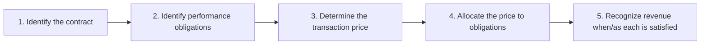
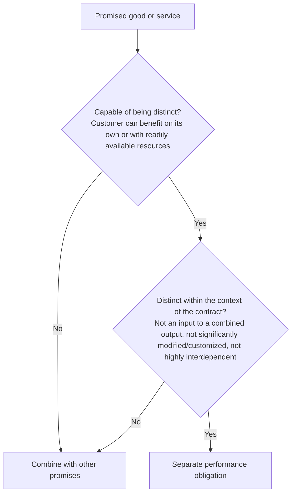

## The five steps at a glance



This module covers Steps 1–2; the next covers Steps 3–5.

## Step 1 — Is there a contract?

A contract (written, oral, or implied by customary practice) is accounted for under ASC 606 only if **all five** are met:

1. The parties have **approved** it and are committed to perform,
2. Each party's **rights** can be identified,
3. **Payment terms** can be identified,
4. It has **commercial substance**, and
5. It is **probable** the entity will collect substantially all of the consideration it's entitled to.

If the criteria aren't met, cash received is recorded as a **liability** until they are met, the contract is terminated, or the entity has no remaining obligations and substantially all consideration is received and nonrefundable.

Contracts entered at or near the same time with the same customer are **combined** if they're negotiated as a package, the price of one depends on the other, or the goods are a single obligation.

```check
far-rev1-chk1
```

## Step 2 — What did we promise?

A promise is a separate **performance obligation** if the good or service is **distinct**:



**Examples**

| Contract | Performance obligations |
|---|---|
| Sell standard software + 2 years of updates + installation any IT firm could do | **Three**: software, updates, installation |
| Build a custom factory: design, materials, construction | **One**: the company integrates them into a single output |
| Sell a car with a standard 3-year manufacturer warranty | **One** (assurance warranty — accrue its cost) |
| Sell a car + optional 5-year extended warranty | **Two**: the car and the service-type warranty |
| Sell a phone with a voucher for 50% off future accessories (not offered to others) | **Two**: the phone and a **material right** |

### Principal or agent?

Ask: **does the company control the good or service before it's transferred to the customer?** Indicators of control: primary responsibility for fulfillment, inventory risk, discretion in setting the price.

- **Principal** → revenue = gross amount billed; cost of sales separately.
- **Agent** → revenue = the **net** fee or commission.

```worked
title: Gross or net?
scenario: |
  An online travel site sells a hotel room to a traveler for $300. It never commits to buy rooms in advance; the
  hotel is responsible for the stay and sets a minimum price; the site keeps $45 and remits $255 to the hotel.
steps:
  - label: Who controls the room before the guest gets it?
    work: The site has no inventory risk and isn't responsible for providing the stay.
    result: The hotel does — the site is an agent
  - label: Revenue recognized by the site
    work: Net commission
    result: 45 (not 300)
insight: If the site pre-purchased blocks of rooms at its own risk and set prices, it would likely be the principal and report 300 of revenue with 255 of cost.
```

```check
far-rev1-chk2
```
