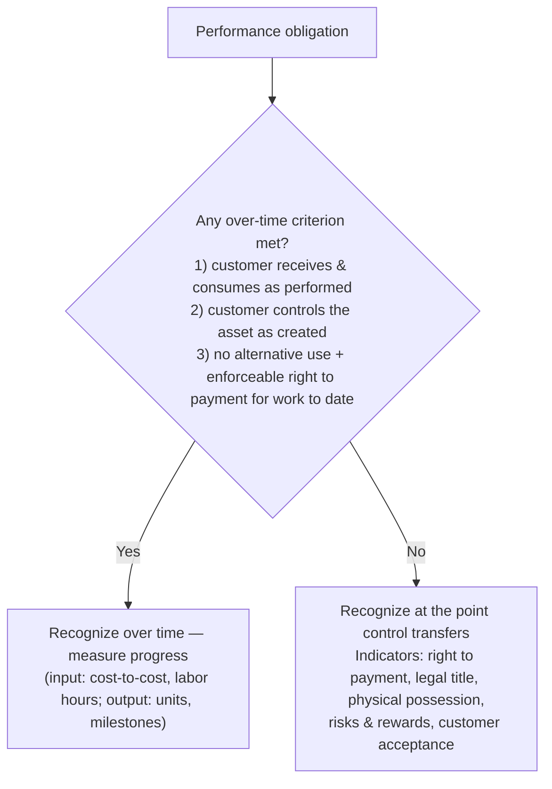

## Step 3 — the transaction price

| Element | Treatment |
|---|---|
| **Variable consideration** (bonuses, penalties, rebates, price concessions) | Estimate with **expected value** (probability-weighted; many outcomes) or **most likely amount** (two outcomes); include only to the extent a **significant reversal is not probable** (the constraint) |
| **Significant financing component** | Adjust to the cash-selling price (practical expedient: ignore if ≤ 1 year) |
| **Noncash consideration** | Fair value at contract inception |
| **Consideration payable to the customer** (coupons, slotting fees) | Reduce the transaction price unless paid for a distinct good or service |
| **Sales taxes collected** | Excluded (may elect to exclude all such taxes) |

```worked
title: Variable consideration — expected value vs. most likely amount
scenario: |
  A contractor earns a $100,000 fee plus a completion bonus. Case A — bonus scale: 60% chance of $20,000,
  30% chance of $10,000, 10% chance of $0. Case B — all-or-nothing $30,000 bonus with a 70% chance.
steps:
  - label: Case A — many possible outcomes → expected value
    work: 0.6 × 20,000 + 0.3 × 10,000 + 0.1 × 0
    result: 15,000 → transaction price 115,000 (if not constrained)
  - label: Case B — two possible outcomes → most likely amount
    work: Bonus is more likely than not to be earned
    result: 30,000 → transaction price 130,000 (if not constrained)
insight: The constraint then asks whether including the estimate could lead to a significant revenue reversal. If yes, include less (possibly zero).
```

**Returns.** A retailer sells 500 units at $100 (cost $60) and expects 5% back: revenue **47,500**, refund liability **2,500**, and an asset for the right to recover goods of **1,500** (5% × 500 × $60), with COGS of 28,500.

```check
far-rev2-chk1
```

## Step 4 — allocate by standalone selling price

```faded
title: Your turn — allocate a bundle discount
scenario: |
  A company sells a bundle for $960: equipment (SSP $800), installation (SSP $150), and two years of service
  (SSP $250). All three are distinct.
steps:
  - label: Total standalone selling prices
    answer: 1200
    solution: 800 + 150 + 250 = 1,200 — the bundle has a 240 (20%) discount
  - label: Amount allocated to the equipment
    answer: 640
    solution: 800 ÷ 1,200 × 960 = 640
  - label: Amount allocated to the service
    answer: 200
    solution: 250 ÷ 1,200 × 960 = 200 (recognized over the two years)
```

A discount is allocated proportionally to **all** obligations unless observable evidence shows it belongs to only some of them. The **residual approach** (total price minus the observable SSPs of other items) is allowed only when an item's SSP is highly variable or uncertain.

## Step 5 — when to recognize



```worked
title: Cost-to-cost over two years
scenario: |
  Contract price $5,000,000. Year 1: costs incurred $1,200,000; estimated total costs $4,000,000.
  Year 2: cumulative costs $2,800,000; revised estimated total costs $3,500,000.
steps:
  - label: Year 1 progress and revenue
    work: 1,200,000 ÷ 4,000,000 = 30%; 30% × 5,000,000
    result: Revenue 1,500,000; gross profit 300,000
  - label: Year 2 cumulative progress and revenue
    work: 2,800,000 ÷ 3,500,000 = 80%; 80% × 5,000,000 = 4,000,000 cumulative
    result: Year 2 revenue = 4,000,000 − 1,500,000 = 2,500,000
  - label: Year 2 gross profit
    work: 2,500,000 − (2,800,000 − 1,200,000)
    result: 900,000 (the estimate change is absorbed in the current and future periods)
insight: If revised estimated total costs had exceeded 5,000,000, the ENTIRE expected loss would be recognized immediately in Year 2.
```

## Balance sheet presentation and contract costs

- **Contract asset**: revenue recognized before the right to payment is unconditional. **Receivable**: unconditional right (only time must pass).
- **Contract liability**: consideration received (or due) before performance.
- **Incremental costs of obtaining a contract** (e.g., sales commissions) are capitalized and amortized — practical expedient: expense if the amortization period is one year or less. **Costs to fulfill** a contract are capitalized only if not covered by other standards, related to a specific contract, generate resources for future performance, and are expected to be recovered.

```check
far-rev2-chk2
```
