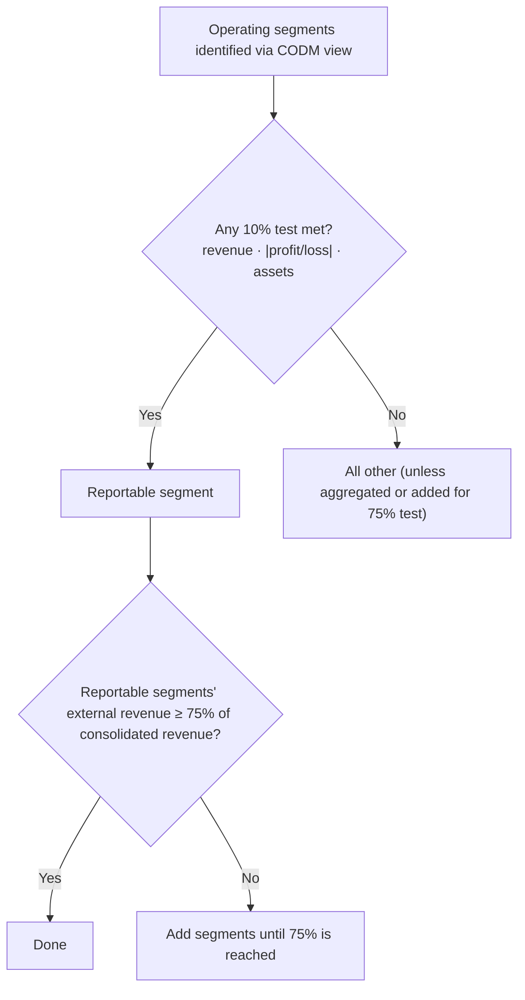

## The SEC's reporting system

The **Securities Act of 1933** governs *initial* registration (e.g., Form **S-1** for an IPO). The **Securities Exchange Act of 1934** governs *ongoing* reporting. Two SEC regulations shape the content:

- **Regulation S-X** — form and content of the **financial statements** and schedules.
- **Regulation S-K** — **everything else** in a filing: business description, risk factors, MD&A, executive compensation, etc.

| Form | Purpose | Audited? |
|---|---|---|
| **10-K** | Annual report: audited financial statements, MD&A, risk factors, management's report on internal control | Yes |
| **10-Q** | Quarterly report for Q1–Q3 (no 10-Q for Q4 — the 10-K covers it) | Reviewed, not audited |
| **8-K** | Current report on significant events (acquisitions, auditor changes, bankruptcy, officer departures) | No |
| **S-1** | Registration statement for new securities | Includes audited statements |
| **DEF 14A** | Proxy statement for shareholder meetings | No |

### Filing deadlines

| Filer category (public float) | 10-K | 10-Q |
|---|---|---|
| Large accelerated (≥ $700 million) | 60 days | 40 days |
| Accelerated ($75 million to < $700 million) | 75 days | 40 days |
| Non-accelerated (< $75 million, or qualifying smaller reporting company with low revenue) | 90 days | 45 days |

Form **8-K**: generally within **4 business days** of the triggering event.

```check
far-sec-chk1
```

## Segment reporting (public entities)

**Step 1 — identify operating segments.** A component is an operating segment if it (1) engages in business activities that earn revenues and incur expenses, (2) has operating results **regularly reviewed by the chief operating decision maker (CODM)** to allocate resources and assess performance, and (3) has **discrete financial information**. Corporate headquarters is usually *not* a segment.

**Step 2 — apply the quantitative thresholds.** A segment is reportable if it meets **any one** 10% test:

1. **Revenue test** — segment revenue (external **plus intersegment**) ≥ 10% of combined revenue of all operating segments.
2. **Profit or loss test** — the absolute value of segment profit or loss ≥ 10% of the **greater of** (a) combined profits of all segments reporting a profit or (b) the absolute value of combined losses of all segments reporting a loss.
3. **Asset test** — segment assets ≥ 10% of combined assets of all operating segments.

**Step 3 — the 75% test.** Total **external** revenue of reportable segments must be at least 75% of consolidated revenue. If not, add more segments (even if they fail the 10% tests) until it is.



```worked
title: The profit-or-loss test
scenario: |
  Segment operating results: A $900,000 profit; B $400,000 profit; C $(600,000) loss; D $150,000 profit;
  E $(80,000) loss.
steps:
  - label: Total profits of profitable segments
    work: 900,000 + 400,000 + 150,000
    result: 1,450,000
  - label: Total losses of loss segments (absolute)
    work: 600,000 + 80,000
    result: 680,000
  - label: Threshold
    work: 10% × the greater amount (1,450,000)
    result: 145,000
  - label: Compare each segment's absolute result
    work: "A 900,000 ✓; B 400,000 ✓; C 600,000 ✓; D 150,000 ✓; E 80,000 ✗"
    result: A, B, C, and D pass the profit-or-loss test
insight: A loss-making segment can be reportable — the test uses absolute values. Segment E could still be reportable under the revenue or asset tests.
```

### What to disclose

- Factors used to identify segments, types of products and services, and the **title/position of the CODM**.
- Segment **profit or loss** and **assets** (as reviewed by the CODM), plus **significant segment expenses** regularly provided to the CODM (ASU 2023-07), and reconciliations of segment totals to consolidated amounts.
- **Entity-wide** disclosures: revenue by product/service, by geographic area (domestic vs. foreign), and **major customers** — if one customer is **10% or more** of revenue, disclose that fact, the amount, and the segment(s) — but **not** the customer's identity.
- Since ASU 2023-07, entities with a **single** reportable segment must also provide the segment disclosures, and most annual segment disclosures are also required in interim periods.

```faded
title: Your turn — revenue and asset tests
scenario: |
  Four operating segments report (in $000s) — revenue including intersegment: W 500, X 300, Y 150, Z 50;
  assets: W 2,000, X 900, Y 700, Z 400.
steps:
  - label: Revenue threshold (in $000s)
    answer: 100
    hint: 10% of combined revenue
    solution: (500 + 300 + 150 + 50) = 1,000 × 10% = 100
  - label: Asset threshold (in $000s)
    answer: 400
    solution: (2,000 + 900 + 700 + 400) = 4,000 × 10% = 400
  - label: How many segments are reportable under the revenue OR asset tests?
    answer: 4
    hint: Z fails revenue (50 < 100) — check its assets.
    solution: W, X, Y pass revenue; Z fails revenue but its assets (400) equal the 10% threshold, so Z passes the asset test. All 4 are reportable.
```

```check
far-sec-chk2
```
