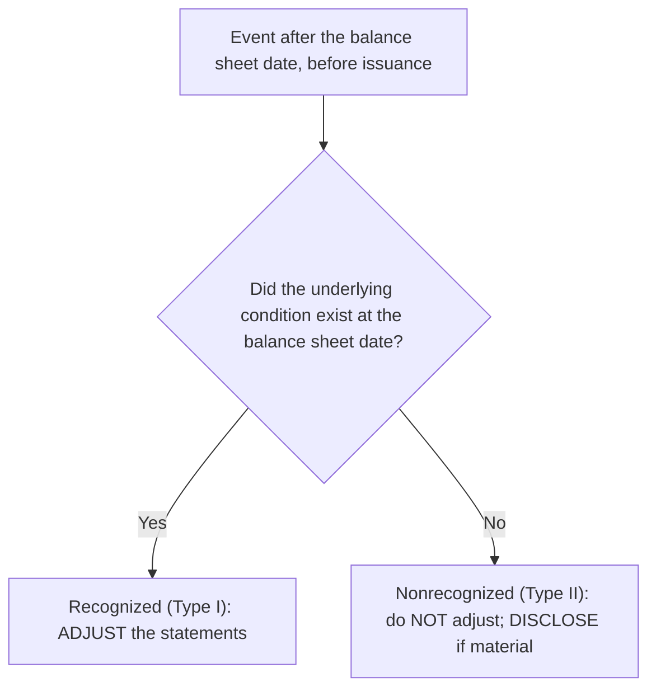

## The timeline

```timeline
title: Two windows, two treatments
events:
  - { when: Dec 31, label: Balance sheet date }
  - { when: Jan–Feb, label: 'Subsequent events window', detail: 'Evaluate everything that happens here' }
  - { when: Mar 1, label: 'Statements issued (SEC filer) or available to be issued (others)' }
```

## Type I vs. Type II



| Event after December 31 | Type | Treatment |
|---|---|---|
| Lawsuit (event occurred before year-end) settled for more than accrued | I | Adjust the liability and expense |
| Major customer files bankruptcy due to a condition that worsened over months | I | Adjust the allowance for credit losses |
| Inventory sold after year-end below its carrying amount due to year-end obsolescence | I | Adjust inventory to NRV |
| Fire destroys a plant | II | Disclose |
| Customer's bankruptcy caused by a flood after year-end | II | Disclose |
| Issuance of bonds or stock; business combination | II | Disclose |
| Decline in market value of investments after year-end | II | Disclose |
| Lawsuit arising from an event after year-end | II | Disclose |

```check
far-se-chk1
```

## How long do you look?

| Entity | Evaluate through | Disclose the date? |
|---|---|---|
| SEC filer | Date statements are **issued** | No |
| All others | Date statements are **available to be issued** | **Yes** — and whether that's the issued or available-to-be-issued date |

```faded
title: Your turn — adjust or not?
scenario: |
  A company accrued $300,000 at December 31 for a lawsuit over an accident that happened in October. On
  February 5, before issuance, it settles for $420,000. On February 10 a flood destroys $250,000 of uninsured
  inventory. Enter the amount to add to the December 31 accrued liability for each (0 if none).
steps:
  - label: Adjustment for the lawsuit settlement
    answer: 120000
    solution: Condition (the accident) existed at year-end → Type I. Increase the liability to 420,000 (+120,000).
  - label: Adjustment for the flood
    answer: 0
    solution: The flood arose after year-end → Type II. No adjustment; disclose the 250,000 loss.
```

```check
far-se-chk2
```
