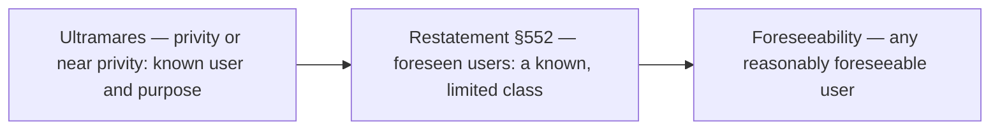

## Common law liability

| Claim | What the plaintiff must show | Who can sue |
|---|---|---|
| Breach of contract | Failure to perform agreed services | Client (and intended third-party beneficiaries) |
| Negligence | Duty, breach (failure to exercise due care), proximate cause, damages | Client; third parties depending on the state rule |
| Gross negligence / constructive fraud | Reckless disregard for the truth | Client and foreseeable third parties |
| Fraud | Material misrepresentation, scienter, justifiable reliance, damages | Client and all foreseeable third parties |

## Third-party negligence claims



From left to right, more third parties can sue for ordinary negligence.

```worked
title: Who can sue for negligence?
scenario: |
  A CPA audits Hart Co. knowing Hart will show the statements to First Bank for a specific loan. Hart also
  gives them to Second Bank (unknown to the CPA) and to an investor who found them online.
steps:
  - label: First Bank
    work: A specifically known user and purpose
    result: Can sue under all three approaches
  - label: Second Bank
    work: A member of a known class (lenders for the loan) but not specifically known
    result: Can sue under the Restatement and foreseeability approaches, not Ultramares
  - label: The online investor
    work: Not known; arguably foreseeable
    result: Can sue for negligence only in a foreseeability state; could sue anywhere for fraud
insight: For fraud and gross negligence, the circle of plaintiffs is large everywhere. The state rule matters only for ordinary negligence.
```

```check
reg-al-chk1
```

## Federal securities laws

| | 1933 Act §11 | 1934 Act §10(b) / Rule 10b-5 |
|---|---|---|
| Applies to | Registration statements (new issues) | Any purchase or sale of securities |
| Plaintiff proves | A material misstatement or omission and a loss | Material misstatement, **scienter**, reliance, causation, damages |
| Negligence required? | No — the burden shifts to the accountant | More than negligence — intent or recklessness |
| Accountant's defenses | Due diligence; the plaintiff knew; the loss had other causes | Lack of scienter; no reliance |

```check
reg-al-chk2
```

## Working papers and privilege

- Working papers are the **accountant's property** but may not be disclosed without client consent, except by subpoena, for peer review or ethics investigations, or as required by law.
- No federal accountant-client privilege in general; **§7525** gives a limited privilege for federal tax advice by federally authorized practitioners in noncriminal tax matters (not written communications promoting tax shelters). Some states grant a statutory privilege.
