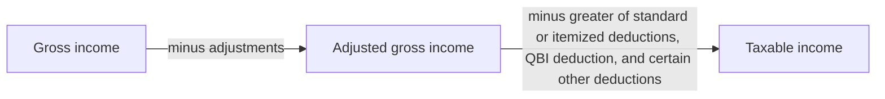

## Above the line vs. below the line



| Adjustment | Key limit (2025) |
|---|---|
| Educator expenses | $300 per eligible educator |
| HSA | $4,300 self-only / $8,550 family (+$1,000 at 55+) |
| Half of self-employment tax | 50% of SE tax |
| Self-employed health insurance | Up to net SE income |
| Traditional IRA | $7,000 (+$1,000 at 50+); phase-outs if an active participant |
| Student loan interest | $2,500; phase-out $85,000–$100,000 (single), $170,000–$200,000 (joint) |
| Early withdrawal penalty on savings | Full amount forfeited |

```check
reg-adj-chk1
```

## IRA phase-out

```worked
title: Partial IRA deduction
scenario: |
  Kira, single, age 35, is covered by her employer's 401(k). Her 2025 MAGI is $83,000. She contributes $7,000 to a traditional IRA.
steps:
  - label: Position in the phase-out range
    work: (83,000 − 79,000) ÷ 10,000
    result: 40% of the way through the range
  - label: Deductible amount
    work: 7,000 × (1 − 40%)
    result: 4,200 (the remaining 2,800 is a nondeductible contribution)
insight: The IRS rounds the reduced limit up to the next $10 — not needed here. Nondeductible contributions create basis that isn't taxed again on withdrawal.
```

## Student loan interest

```faded
title: Your turn
scenario: |
  Owen, single, paid $2,000 of student loan interest. His MAGI is $91,000.
steps:
  - label: Fraction of the phase-out range used
    answer: 0.4
    tolerance: 0.001
    solution: (91,000 − 85,000) ÷ 15,000 = 0.4
  - label: Deductible interest
    answer: 1200
    solution: 2,000 × (1 − 0.4) = 1,200
```

```check
reg-adj-chk2
```

## Reviewing AGI and taxable income

Work down the return in order, because each amount feeds the next limit:

1. **Adjustments for AGI.** Check each one against its own limit: half of SE tax; SEP (20% of net SE earnings after half of SE tax); HSA (coverage and the annual limit given in the problem); self-employed health insurance (above the line, not itemized); student loan interest (2,500 cap and phase-out).
2. **AGI.** Recompute it; AGI-based floors (medical 7.5%) and phase-outs depend on it.
3. **Standard vs. itemized.** An item moved above the line (such as SE health premiums) cannot also be itemized.
4. **QBI deduction.** 20% of QBI, where QBI is **reduced** by the deductible part of SE tax, SE health insurance and retirement contributions attributable to the business, **limited** to 20% of taxable income before the QBI deduction (less net capital gain).

**Resolving diagnostics.** Tax software raises a diagnostic whenever an entry looks unusual. It is a question, not an error. For each one, decide whether:

1. the **input is wrong** — fix the entry;
2. the entry is **right and the difference is expected** — clear the flag and document why; or
3. the source documents **cannot answer it** — ask the client.

Clearing a flag without understanding it is how errors reach a filed return.
