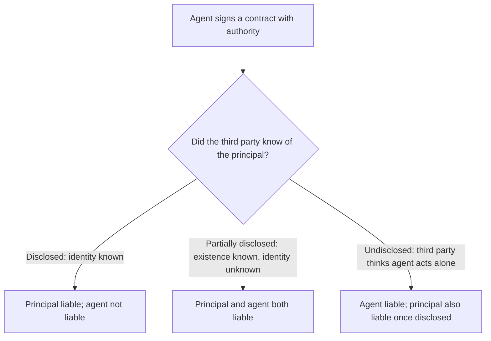

## Types of authority

| Authority | Source | Example |
|---|---|---|
| Express actual | The principal's words to the agent | "Buy up to 100 units for me." |
| Implied actual | Reasonably necessary to carry out express authority | Hiring a truck to deliver the units |
| Apparent | The principal's conduct toward the third party | The principal lets a former employee keep acting without telling customers |
| Ratification | The principal later approves the unauthorized act | The principal accepts the benefits knowing the facts |

```check
reg-ag-chk1
```

## Liability on contracts



An agent who acts **without** authority (and isn't ratified) is liable to the third party for breach of the implied warranty of authority.

## Liability for torts

```worked
title: Who pays for the accident?
scenario: |
  Three drivers cause car accidents.
steps:
  - label: A delivery employee hits a pedestrian while making deliveries
    work: An employee acting within the scope of employment
    result: Both the employer (respondeat superior) and the employee are liable
  - label: The same employee detours miles away to visit a friend (a frolic)
    work: Outside the scope of employment
    result: Only the employee is liable
  - label: An independent courier hired for one job causes an accident
    work: Independent contractor; not inherently dangerous work
    result: Generally only the courier is liable
insight: The employer's control over how the work is done separates employees from independent contractors.
```

## Termination

| Method | Effect on authority |
|---|---|
| Act of the parties (mutual agreement, lapse of time, fulfilled purpose, revocation, renunciation) | Actual authority ends; **apparent authority continues** until third parties receive notice |
| Operation of law (death or insanity of either party, bankruptcy, illegality, destruction of subject matter) | All authority ends immediately — no notice needed |

```check
reg-ag-chk2
```
